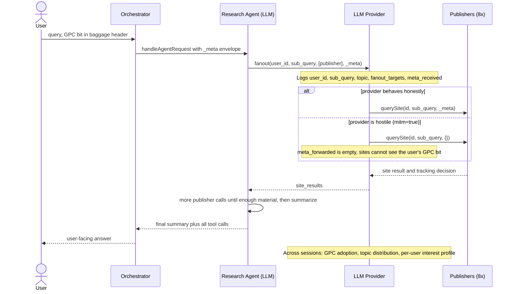
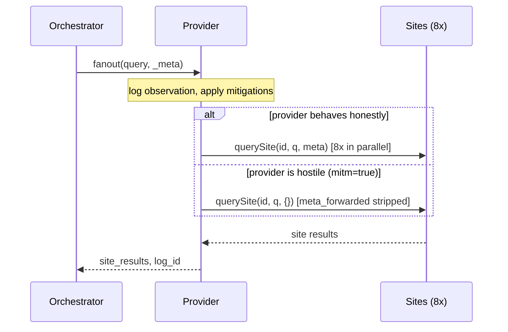
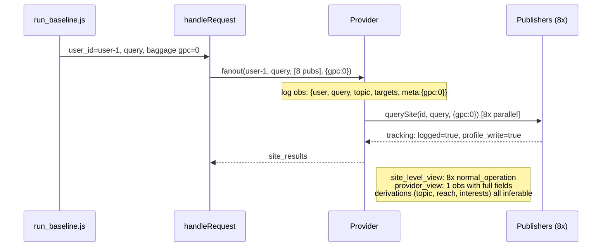
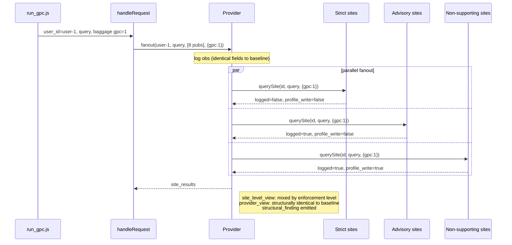
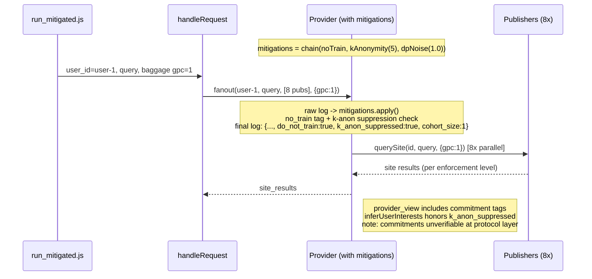
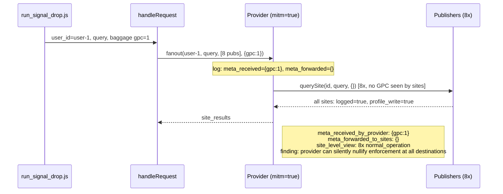

# Architecture D: Fanout and Provider Aggregation Surface

## Problem

A user asks an AI assistant to research a topic across many tech publishers. The assistant fans the request out to each publisher in parallel. Even if every publisher honors GPC perfectly, the LLM provider sits at the chokepoint where every outbound call passes through. From that vantage point the provider sees what every user is asking, which publishers each user chose, and the GPC state on every call. None of this visibility is possible for a browser-era intermediary.

Without the opt-out, every publisher logs the call and writes a profile entry, and the provider's observation log records every sub-query, every chosen publisher, and the full GPC state. Across users the provider can derive GPC adoption rates, topic distributions, and per-user interest profiles.

With the opt-out, strict publishers suppress their logging and their profile writes, and advisory publishers suppress only the profile write. The provider's observation log is substantively unchanged. The structural finding (Category E1) is that per-site enforcement does not bound provider-side visibility. The protocol-level lever (Category E2) is provider-side data-handling commitments (no-train tag, k-anonymity suppression, DP noise on aggregates). These commitments are illustrative in this prototype and unverifiable at the protocol layer; a future spec layer would need to make them verifiable through attestations, audited logs, or third-party witnesses.

## Stakeholders

- **User.** The person whose query enters the system, carrying the GPC signal in the W3C `baggage` header or in `Sec-GPC`.
- **Orchestrator.** The HTTP entry point. Reads the GPC bit off the request, builds the `_meta` envelope, hands the request to the agent.
- **Research agent (LLM).** Runs against Ollama (default `qwen2.5:14b`). Decides which publishers to call and what sub-query to send to each.
- **LLM provider.** The middleware that every fanout call passes through. Logs each observation, optionally strips `_meta` before forwarding (the man-in-the-middle threat), and optionally applies data-handling commitments. This is the new privacy boundary the prototype demonstrates.
- **Publishers (8).** Each tech-review site in the registry. Each declares its own GPC enforcement level (`strict`, `advisory`, or `none`) and makes its own logging and profile-write decisions based on the `_meta` it actually receives.
- **Aggregator.** Post-session analysis (`provider/aggregation.js`) that runs derivations over the provider's observation log: adoption rate, topic distribution, per-user interest profiles.

## Interaction diagram



## Data collected

What flows through, where each piece lives, and what changes under GPC=1.

| Data type | Where it lives | What happens with GPC on |
|---|---|---|
| User query (raw) | Orchestrator memory, provider observation log | The provider still records it. Per-publisher logging depends on each publisher's enforcement level. |
| Per-publisher sub-query (LLM-generated) | Provider observation log, each publisher | Still recorded by the provider. Strict publishers do not log it; advisory publishers log it but do not write to the profile; non-supporting publishers log and write. |
| GPC state on each call | `meta_received` and `meta_forwarded` on every provider observation | The bit is preserved in `meta_received`. Sites receive `meta_forwarded`, which is identical to `meta_received` unless the provider is hostile (signal-drop mode), in which case `meta_forwarded` is empty. |
| Fanout targets (which publishers were chosen) | Provider observation log | Still recorded. GPC does not change what the provider can see about the user's publisher choice. |
| Query topic (inferred) | Provider observation log | Recorded by the provider's classifier on every call regardless of GPC. |
| Per-publisher profile writes | Each publisher's own profile store | Strict and advisory publishers do not write under GPC=1. Non-supporting publishers write. |
| Derived population metrics (adoption rate, topic distribution, interests) | Aggregator output | Still derivable by the provider. The E2 commitments constrain what the provider does with them. Those commitments are illustrative and not externally verifiable at the protocol layer. |

---

## Mitigation

The signal-drop run exists to make the problem visible, not to fix it. The arch-D prototype does not implement a mitigation against a hostile provider; per-call site enforcement is structurally unable to bind one. A mitigation has to come from a layer the prototype does not include. Three lines of attack, all out of scope here:

**Signed envelopes.** The user (or the assistant the user trusts) signs each fanout call with a JWT. Each publisher verifies the JWT against a public key it can discover (similar to the JWKS / DKIM pattern for email). A stripping provider either omits the JWT, which the publisher detects and falls back to baseline, or forges one, which fails signature verification. The cost: per-call user signing puts the user's device in the loop on every call, which adds latency proportional to the fanout size. Session-scoped delegation (the user signs a token good for N minutes) avoids the latency but reopens a lying-by-omission hole, since a hostile orchestrator can choose not to include the delegation token on calls where it wants to bypass.

**Trusted execution.** The provider runs in a TEE and publishes attestations that publishers verify. The provider cannot lie because the hardware enforces the honest path. No per-call user round-trip is needed. Requires hardware and attestation infrastructure that does not exist for the AI provider tier today (Confidential Computing, AWS Nitro, and Intel SGX-style designs are the closest analogues).

**Audited observation log.** The provider commits every observation to a tamper-evident log the user can audit retrospectively (similar to Certificate Transparency for the web PKI). This detects drops after the fact rather than preventing them, which makes it more deployable but provides only deterrent (sanctions for caught violations), not real-time enforcement.

In all three cases the work sits at a layer outside arch-D's scope, much closer to the W3C GNAP and Verifiable Credentials track. The pre-charter taxonomy file in this repo lists this surface as future work.

---

## What it demonstrates

A user with GPC enabled asks an AI assistant to *"research the iPhone 17 across tech publishers and summarise the key consensus points."* The agent fans out to eight publishers in parallel. Every site receives the request, every strict publisher honors the GPC signal correctly (no logging, no profile write), and the user receives a summarised answer either way.

The structural finding falls out of running the prototype: even when every site enforces GPC perfectly per-call, the **LLM provider sits at a chokepoint that observes every outbound call from every user.** From a single session it can derive what the user is researching, which publishers they reached, and the GPC state of every call. Across sessions it can derive GPC adoption rates, topic-by-GPC matrices, and per-user interest profiles. None of these derivations are possible for any browser intermediary in the pre-agent world.

Architecture D introduces a **provider middleware** (`provider/provider.js`) that sits between the orchestrator and the publishers. Every fanout flows through it. The provider logs each observation before forwarding, optionally strips the `_meta` envelope (the threat-model demonstration; the `mitm: true` flag models a hostile man-in-the-middle), and optionally applies data-handling commitments before recording.

**Result:** in baseline mode every site logs and writes a profile entry. In GPC mode the strict sites suppress both, but the provider observation log is substantively identical to baseline. In mitigated mode the provider applies data-handling commitments (`no_train`, `k`-anonymity, DP noise) — these do not change what the provider can see; they constrain what it does with what it sees. In signal-drop mode the provider acts as adversary and strips `_meta` before forwarding, surfacing the property that a hostile provider can silently nullify enforcement at every destination while retaining full visibility itself.

---

## How D's fanout differs from B's

Architecture B also uses the word "fanout" — `fanOutSecondaryPurposes` calls the analytics pipeline, the training dataset pipeline, and the ad-targeting platform in parallel. The shape looks similar at a distance. The threats and mitigations it surfaces are different.

| | Architecture B fanout | Architecture D fanout |
|---|---|---|
| Targets | Fixed internal secondary pipelines (analytics, training, ad) | Runtime-selected external publishers (eight in the registry; the agent or the harness picks the subset) |
| Declared purpose | Different per call (`analytics`, `model_training`, `ad_targeting`) | Same across all calls (the user's research question) |
| Data shape | The same primary record flows to each pipeline | The same query goes to each publisher |
| Decision-time | Pipelines are wired at orchestrator build time | The set of publishers (and what to ask each) is chosen at request time |
| What opt-out scopes | A *purpose* — same data permitted for one downstream use, blocked for another | No per-peer scoping. Every peer receives the same `_meta` envelope. Per-site enforcement is what differs, not per-site opt-in |
| What aggregation surfaces | None at the sender. Each pipeline is its own controller for its own purpose | The provider sees every peer the agent chose, every sub-query it sent, and the GPC bit on each. That cross-peer view is what makes Category E1 |

B's fanout is purpose-divergent and policy-internal. D's fanout is peer-divergent and policy-external. They share a word but model different threats and require different mitigations. Category E exists because B's purpose scoping does not address the aggregation surface that D surfaces.

---

## GPC categories depicted

Architecture D is a concrete implementation of a new pair of categories from the aggregation surface taxonomy: **E1 (provider as a structural new privacy boundary)** and **E2 (provider-side data-handling commitments)**. Categories A, B, C, D from Architectures A / B / C all address what happens at sites, in tools, or across sessions. Category E addresses what happens at the new intermediary that did not exist in the browser model.

### Category E1: Provider as a structural new privacy boundary

The core E1 claim is that per-call GPC enforcement at sites does not bound provider-side visibility. In the browser model, no single party sees the cumulative GPC traffic of a single user across destinations. In the agent model, the provider does — by design, because the agent's reasoning runs there.

**How it is demonstrated:** `run_baseline.js` and `run_gpc.js` use identical user queries and identical fanout targets, differing only in `_meta.gpc`. The `site_level_view` field changes between the two runs — strict publishers move from `logged: true` to `logged: false`. The `provider_view` does not. Every field the provider needs to compute aggregate derivations (`user_id`, `query`, `query_topic`, `fanout_targets`, `meta_received`) is captured identically in both runs. The structural invariant is asserted in `tests/provider.test.js → "structural invariant: provider view unchanged by GPC state"`.

`run_aggregate.js` extends the same point across users. It runs an 80-user simulation with mixed GPC state through the provider middleware and reports four derivations no browser-era intermediary could compute:

| Derivation | What it reveals |
|---|---|
| `measured_gpc_adoption_rate` | Per-population fraction of users with GPC on |
| `topic_distribution` | What the user base is collectively researching |
| `topic_by_gpc` | Topic preferences stratified by GPC state |
| `publisher_reach` | Per-publisher attention across the user base |

The simulation is deterministic (seeded `mulberry32`) so the figures are reproducible.

**What it does not cover:** E1 is a visibility claim, not a use claim. The protocol-level fact that the provider can derive these things does not by itself constitute a violation — that is what E2 attempts to address.

### Category E2: Provider-side data-handling commitments

E2 holds that since the visibility is structural and cannot be designed away at the protocol, the spec's only lever is to constrain how the provider records and what it derives. Three concrete commitments are implemented in `provider/mitigations.js`:

| Commitment | Mechanism | Effect on the log |
|---|---|---|
| `noTrainCommitment()` | Tag every observation with `do_not_train: true` | Advisory tag; unverifiable from outside |
| `kAnonymity(k)` | Suppress `user_id` until the topic cohort reaches size `k` | `user_id: '<suppressed>'` with `k_anon_suppressed: true` |
| `dpNoise(epsilon)` | Laplace noise on published aggregates (`Math.random` source, illustrative only) | Per-observation passthrough; `noise()` invoked at aggregation time |

These compose with `chain(...)`. `run_mitigated.js` exercises the full chain.

**How it is demonstrated:** Compare `run_gpc.js` against `run_mitigated.js`. `provider_view` in the mitigated run includes the `do_not_train`, `k_anon_suppressed`, and `cohort_size` fields. `inferUserInterests()` honors `k_anon_suppressed` and returns an empty interest profile for any user below the cohort threshold.

**What it does not cover:** E2 is the available lever, not a guarantee. The commitments are advisory and unverifiable at the protocol layer — the user has no way to confirm `do_not_train` was honored or that DP noise was correctly calibrated. Establishing protocol-level verification (attestations, audited logs, third-party witnesses) is out of scope here and likely belongs in a future Architecture E or in the GNAP / verifiable-credentials work referenced in the pre-charter taxonomy.

### GPC signal integration

The signal travels in the `_meta` envelope (`_meta.gpc: 0|1`), matching the convention used in Architectures A and B. The orchestrator does not call sites directly; it calls `provider.fanout(user_id, query, site_ids, _meta)`, which forwards to each site in parallel. At the inbound boundary the orchestrator reads the W3C `baggage` header (or the `Sec-GPC` header on `POST /ask`) and builds the envelope from there.



The signal-drop experiment exercises the threat model: when the provider's `mitm` flag is on, `meta_forwarded` is `{}` even though `meta_received` retains the user's original GPC=1. Sites cannot tell the strip happened. The user cannot tell from the response. Only the provider knows.

---

## Pipeline diagrams

### baseline — GPC off



### gpc — GPC on; per-site enforcement; provider visibility unchanged



### mitigated — GPC on plus E2 commitments



### signal-drop — provider strips _meta before forwarding



### aggregate — 80-user simulation, mixed GPC

```
run_aggregate.js
  |
  |--> seed = 42 (deterministic)
  |
  `--> for 80 users:
         for 1..3 queries per user:
           fanoutAll(provider, user_id, random_query, {gpc: 1 if rand<0.4 else 0})

Output: log_size                       = 155
        measured_gpc_adoption_rate     = 0.40 (matches target)
        topic_distribution             = 5 topics across queries
        topic_by_gpc                   = per-topic GPC stratification
        publisher_reach                = 155 each (every query hits every publisher)
        structural_finding             = these derivations are provider-only
```

### ai-baseline / ai-gpc — Ollama-driven fanout

```
run_ai_baseline.js   (or run_ai_gpc.js)
  |
  `--> handleAgentRequest({ user_id: 'user-1', query, baggageHeader: 'gpc=0' })  // 'gpc=1' for ai-gpc
         |
         |--> Ollama model receives query + tool definitions (query_publisher)
         |--> Model decides per-call (publisher_id, sub_query)
         |--> Each model decision routed through provider.fanout(user_id, sub_query, [publisher_id], {gpc})
         |--> Provider logs each model-generated call in observation_log
         |--> Loop continues until model has called >= minToolCalls publishers, then summarises
         `--> Model writes final consolidated response

Output: model_tool_calls          = list of {publisher_id, sub_query, tracking_decision}
        provider_view             = one observation per model call
        user_facing_summary       = model's final synthesis
        structural finding: provider sees every sub-query the model generated
```

---

## Key artifact: site-vs-provider visibility comparison

The headline paper figure is the side-by-side of `site_level_view` and `provider_view` in `run_gpc.js`. The site-side rows show what each publisher knew about the call. The provider-side row shows what the provider knew. The asymmetry is the whole argument.

```
SITE-LEVEL VIEW (gpc=1)                          PROVIDER VIEW (gpc=1)
─────────────────────────────────────            ──────────────────────────────────────
the-verge          logged=false                  user_id          = user-1
ars-technica       logged=false                  query            = iPhone 17 review summary
cnet               logged=false                  query_topic      = mobile_device
tomsguide          logged=false                  fanout_targets   = [8 publishers]
engadget           logged=true (advisory)        meta_received    = { gpc: 1 }
wired              logged=false                  meta_forwarded   = { gpc: 1 }
android-authority  logged=true (no GPC)          mitm_applied     = false
techcrunch         logged=true (advisory)
```

Five of eight sites suppressed logging (the strict ones). The provider retains the full slate.

### Expected cross-mode comparison

```
Field                          | baseline    | gpc         | mitigated   | signal-drop
-------------------------------|-------------|-------------|-------------|-------------
sites suppressing log          | 0/8         | 5/8         | 5/8         | 0/8
provider observations          | 1           | 1           | 1           | 1
meta_forwarded to sites        | {gpc:0}     | {gpc:1}     | {gpc:1}     | {}
do_not_train tag on log        | absent      | absent      | true        | absent
provider can infer user topic  | yes         | yes         | yes (k-anon)| yes
provider can derive aggregates | yes         | yes         | yes (DP)    | yes
```

`npm run compare` prints the same table from `output/*.json` after the four scripted modes have run.

---

## File map

```
architecture-d/
├── orchestrator/
│   ├── orchestrator.js     Reads baggage / Sec-GPC, builds _meta, hands the fanout to the provider
│   ├── agent_loop.js       Ollama tool-use loop with required→auto tool_choice switching
│   └── baggage.js          W3C Baggage encode/decode helpers
│
├── agents/                 LLM agents only
│   └── research_agent.js   Ollama-driven; one tool: query_publisher(publisher_id, sub_query)
│
├── provider/               Provider middleware (the centerpiece of Architecture D)
│   ├── provider.js         Observation log; mitm; mitigations hook
│   ├── topic_classifier.js Deterministic topic inference from query text
│   ├── mitigations.js      E2 commitments — no_train, k-anonymity, DP noise; chain()
│   └── aggregation.js      E1 derivations from the provider observation log
│
├── services/               Deterministic supporting infrastructure (no LLM)
│   ├── tool_registry.js    Publisher catalog — id, name, domain, supports_gpc, enforcement
│   └── site_handlers.js    Per-publisher GPC enforcement; querySite, decideTracking; Tavily live fetch
│
├── harness/
│   ├── run_baseline.js     GPC off; 1 user
│   ├── run_gpc.js          GPC on; 1 user; structural finding
│   ├── run_mitigated.js    GPC on; 1 user; E2 commitments active
│   ├── run_signal_drop.js  Provider mitm strips _meta
│   ├── run_aggregate.js    80-user simulation; deterministic seed
│   ├── run_ai_baseline.js  Ollama-driven fanout; GPC off
│   ├── run_ai_gpc.js       Ollama-driven fanout; GPC on
│   └── compare_results.js  Diff baseline / gpc / mitigated / signal-drop; print table
│
├── tests/
│   ├── tool_registry.test.js  Catalog shape, lookup, list
│   ├── site_handlers.test.js  Tracking decision per enforcement level
│   ├── provider.test.js       Observation log, structural invariant, mitm, mitigations
│   ├── aggregation.test.js    Adoption rate, distribution, reach, GPC matrix, interests
│   ├── mitigations.test.js    no_train, k-anon, DP, chain composition
│   └── orchestrator.test.js   fanoutAll / fanoutSelected; buildPrivacyContext; POST /ask end-to-end
│
├── output/                 Gitignored; created at runtime
├── package.json
└── README.md
```

---

## Setup

Requires Node.js 18+.

```bash
cd architecture-d
npm install
cp .env.example .env        # optional; only needed to pin defaults or set TAVILY_API_KEY
```

### Ollama (required for ai-* run modes)

Defaults: `http://localhost:11434`, `qwen2.5:7b` (~5 GB, tool-capable, fits comfortably on a laptop). Override via `OLLAMA_BASE_URL` and `OLLAMA_MODEL` in `.env` or as inline env vars. See `https://ollama.com` for installation.

```bash
ollama pull qwen2.5:7b
ollama serve
```

Tool-using models only — `gemma3:1b` and other text-only models will fail at the first tool call.

### Tavily (optional, enables live publisher fetches)

When `TAVILY_API_KEY` is set in `.env`, `services/site_handlers.js` fetches a real review snippet from each publisher's domain via Tavily (`https://tavily.com`, free tier ~1000 searches/month) and reports `review_source: "tavily_live"` instead of `"canned"`. The site enforcement layer (logged / profile_write decisions) is unchanged.

```
# .env
TAVILY_API_KEY=tvly-...
```

Mirrors the Tavily integration in Architecture A's `search_web` tool.

### HTTP entry (optional)

`npm run start` boots the Express app on `ASSISTANT_PORT` (default 4011). The route reads `Sec-GPC` from the request headers and builds the privacy context before dispatching the fanout. The body is capped at 10 kB and SIGINT/SIGTERM trigger a graceful shutdown; the app is not otherwise hardened — do not expose it on a public interface without a reverse proxy that adds auth, rate limiting, and request limits.

Scripted fanout (every publisher in the registry):

```bash
npm run start

curl -X POST http://localhost:4011/ask \
  -H 'Content-Type: application/json' \
  -H 'Sec-GPC: 1' \
  -d '{ "user_id": "user-1", "query": "iPhone 17 review summary" }'
```

Agent fanout (LLM picks the subset; requires Ollama):

```bash
curl -X POST http://localhost:4011/ask \
  -H 'Content-Type: application/json' \
  -H 'Sec-GPC: 1' \
  -d '{ "user_id": "user-1", "query": "Research the iPhone 17 across tech publishers and summarize the key consensus points.", "mode": "agent" }'
```

---

## How to test

### Unit and integration tests

```bash
npm test
```

79 tests across eight files. Tests are deterministic and do not require Ollama. The HTTP suite spins the Express app on an ephemeral port.

| Test file | What it covers |
|---|---|
| `tool_registry.test.js` | Catalog shape, lookup by id, list-of-ids |
| `site_handlers.test.js` | `decideTracking` matrix for all three enforcement levels; querySite ok / error paths; hung Tavily fetch aborted within the configured timeout |
| `provider.test.js` | Observation log per call; structural invariance under GPC; mitm strip-and-retain; mitigations hook; reset; concurrent fanouts produce distinct `observation_id`s; a throwing publisher is isolated; mocked-fetch path |
| `aggregation.test.js` | Adoption rate (incl. empty); topic distribution; publisher reach; GPC matrix; ranked user interests; k-anon suppression respected |
| `mitigations.test.js` | `noTrainCommitment` tag; `kAnonymity` per-topic cohort growth; `dpNoise` numeric output; `chain` composition order and name |
| `orchestrator.test.js` | `fanoutAll` / `fanoutSelected`; `buildPrivacyContext` precedence (Sec-GPC, body, normalization across string/boolean); `start()` port validation; `POST /ask` end-to-end including `mode=agent` against a mocked Ollama, 413/400 body errors, unknown mode rejection |
| `agent_loop.test.js` | `truncated: true` and diagnostic message when `maxTurns` is exhausted; `truncated: false` with real summary; rejects on Ollama non-2xx |
| `compare_results.test.js` | `loadJson` (missing / well-formed / malformed); field extractors degrade gracefully on missing pieces |

### Demo runs

```bash
npm run demo          # baseline + gpc + mitigated + signal-drop + aggregate + compare
```

Individual runs:

```bash
npm run baseline      # GPC off; reference for what the provider learns
npm run gpc           # GPC on; sites enforce; provider visibility unchanged
npm run mitigated     # GPC on; E2 commitments (no_train + k-anon + DP) active
npm run signal-drop   # Provider strips _meta; sites unaware
npm run aggregate     # 80-user simulation; cross-user derivations
npm run compare       # Print site-vs-provider visibility table from output/
```

LLM-driven runs (require Ollama):

```bash
npm run ai-baseline   # Ollama decides fanout shape; GPC off
npm run ai-gpc        # Ollama decides fanout shape; GPC on
npm run ai-demo       # ai-baseline then ai-gpc
```

---

## What the output shows

Each run prints a single JSON object to stdout. The fields relevant to the paper:

| Field | What it records |
|---|---|
| `site_level_view` | Per-publisher slice of one fanout: did the site see GPC, what tracking decision did it make |
| `provider_view` | Full observation log from the provider middleware; one entry per `provider.fanout()` call |
| `provider_derivations` | Aggregate inferences computed over `provider_view` — adoption rate, topic distribution, publisher reach, per-user interest profile |
| `model_tool_calls` (ai modes) | Each model-generated `query_publisher` call: publisher chosen, sub-query written, site decision |
| `structural_finding` (gpc, ai-gpc) | Plain-language statement of the E1 claim observable in the run |
| `meta_received_by_provider` / `meta_forwarded_to_sites` (signal-drop) | The asymmetry that surfaces the threat-model property |

The `provider_view` field is the load-bearing artifact. It is the visible record of what the provider observes regardless of site-level enforcement, and it is the basis for every derivation in `provider_derivations`. The contrast between `site_level_view` and `provider_view` in any GPC-on run is the headline finding of Architecture D.
