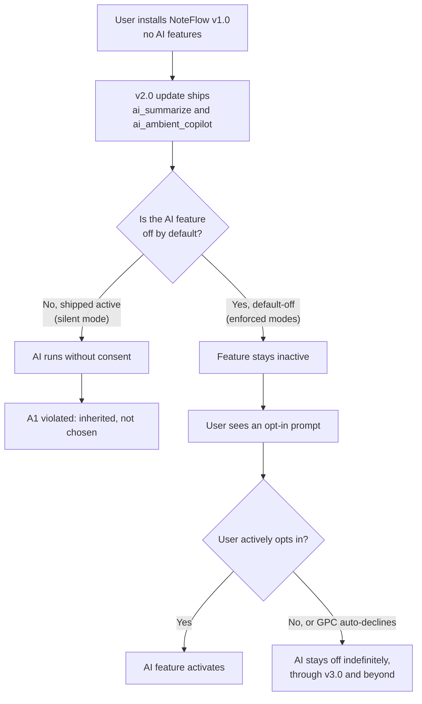
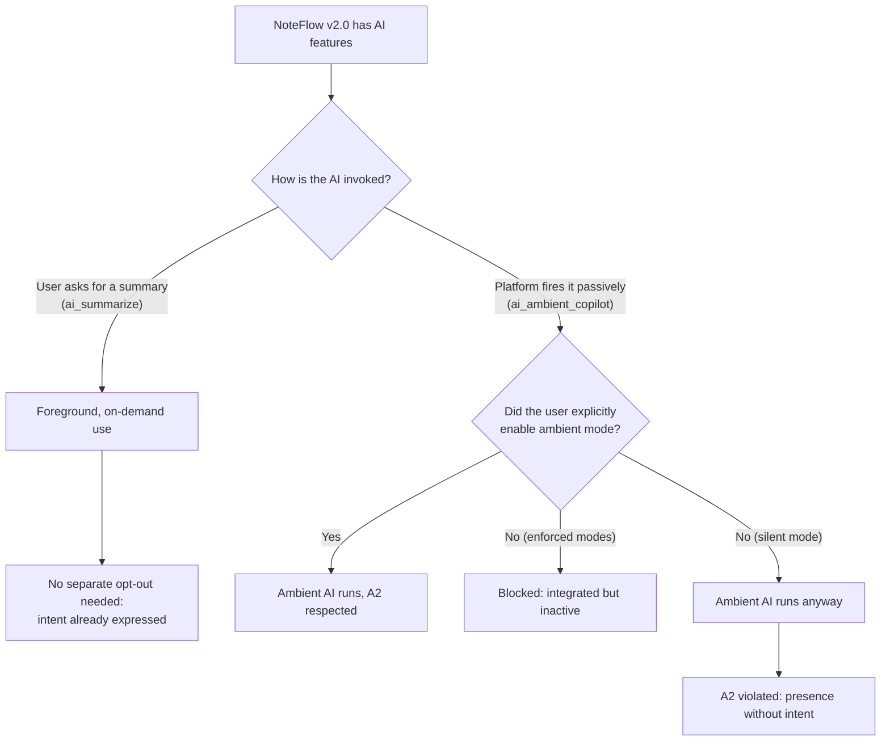

# Category A: Presence

Opting out of AI being in your environment at all.

This prototype targets Category A of the opt-out typology and its two subtypes, no more, no less:

| Subtype | Governs | In this prototype |
|---------|---------|-------------------|
| A1 (integration) | How AI enters a system. AI features cannot be added via an update without explicit affirmative consent, and must ship off by default. | `ai_summarize` and `ai_ambient_copilot` arrive in the v2.0 update and are off until the user opts in. |
| A2 (activation) | Whether AI is present without the user's active intent. AI cannot operate passively unless the user affirmatively chose it. Foreground, on-demand use is exempt. | `ai_ambient_copilot` runs passively and needs the separate ambient opt-in. `ai_summarize` is on-demand and does not. |

## Scenario

A user installs NoteFlow v1.0, a note-taking app with no AI features. The v2.0 update ships two AI capabilities:

- `ai_summarize`: a foreground feature the user invokes on demand.
- `ai_ambient_copilot`: a passive assistant the platform runs in the background while the user types.

Without enforcement, both activate silently on update. With enforcement, a presence gate checks every feature call: A1 keeps un-consented AI off no matter what the update shipped, and A2 keeps passive AI inactive until the user explicitly enables ambient mode. The two controls are independent: a user can turn a feature on (waiving A1 for it) while keeping ambient mode off (asserting A2).

## A1 flow: integration opt-out



## A2 flow: activation opt-out



## How enforcement works

Every feature call goes through `invokeFeature()` in [presence_gate.js](presence_gate.js). Checks run in this order:

1. Non-AI features (`note_read`, `note_save`) always run. Category A governs AI presence only.
2. A1: a declined AI feature is blocked with no prompt, across every later update.
3. A1: under GPC, an undecided AI feature is auto-declined without prompting. The global signal makes the decision the prompt would have asked for.
4. A1: an undecided AI feature fires an opt-in prompt. Decline keeps it off; approve turns it on and persists.
5. A2: a passive invocation (a passive feature, or any call initiated by the platform instead of the user) additionally requires `ambient_enabled` in the manifest. GPC keeps passive activation off even if ambient mode was on.

The user's standing decisions live in [presence_manifest.json](presence_manifest.json), seeded to the fresh-install state on every run.

## Setup

```bash
npm install
```

The scripted paths need nothing else. The live agent path needs Ollama running locally (`ollama serve`, `ollama pull qwen2.5:14b`; override with `OLLAMA_MODEL`).

## Demo

| Command | What it shows |
|---------|---------------|
| `npm run v1` | v1.0 install: no AI exists, nothing to gate. |
| `npm run v2:silent` | Violation baseline: both AI features run without consent. Output annotates the A1 and A1+A2 violations. |
| `npm run v2:approve` | A1 satisfied through opt-in prompts. `ai_summarize` runs. `ai_ambient_copilot` is enabled but stays inactive: A2 still blocks it. |
| `npm run v2:decline` | User declines the prompts. Both AI features stay off, and stay off in the simulated v3.0. |
| `npm run v2:ambient` | User enabled ambient mode in settings first. The copilot now runs: both A1 and A2 were affirmatively waived. |
| `npm run v2:gpc` | GPC signal active. Both AI features are auto-declined with no prompts; passive activation stays off. |
| `npm run demo` | All of the above in sequence. |

Live agent versions (a real model chooses the calls, the gate still decides):

```bash
npm run agent          # opt-in prompts fire mid-conversation
npm run agent:ambient  # ambient pre-enabled, copilot runs
npm run agent:gpc      # AI features auto-declined, model works around them
```

## Tests

```bash
npm test
```

63 tests cover the registry, the manifest, the gate (A1, A2, GPC, independence of the two subtypes), full orchestrated sessions in every mode, and the agent tool surface.

## What it prevents

AI features entering the app silently through an update (A1), and AI running passively without the user's active intent (A2).

## What it does not prevent

Anything downstream of presence: what an active, consented AI feature collects, how data is used, how long it is retained, or what an agent decides on the user's behalf. Those are Categories B through E.
