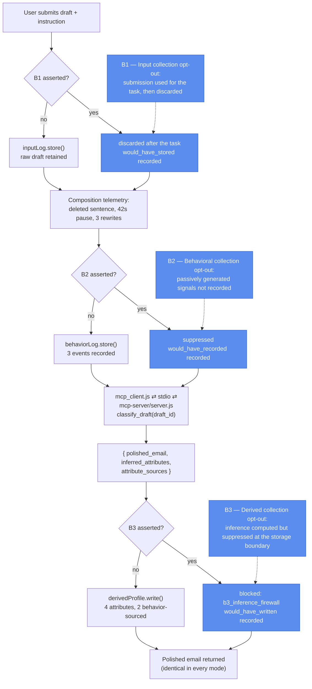

# Category B: Collection

## What it demonstrates

A user asks an AI writing assistant to polish one email to their manager about a raise. The draft mentions rising doctor visits. While composing it, the user deleted a sentence about treatment costs before submitting, paused 42 seconds over the salary line, and rewrote the opening three times.

Three different things about that user are now available to the platform, and they are not the same kind of thing. The draft is what the user *knowingly submitted*. The deletion, the pause, and the rewrites are what they *unknowingly generated*. The health condition and the negotiation anxiety a classifier reads out of both are what the system *concluded on its own*. Existing privacy language reaches the first and struggles with the second and third: nothing was sold, and the most revealing sentence was never even sent.

Category B puts a gate at each of the three boundaries. The task is never gated: the polished email is returned identically in every mode. What changes is what the platform keeps.

| Mechanism | Where | What it does |
|---|---|---|
| **Session fixture** | `session_fixture.js` | One synthetic session: instruction, draft text, and three telemetry events. Static, so runs stay deterministic. |
| **Inference classifier** | `inference_classifier.js`, served over MCP | Maps the draft to `polished_email`, `inferred_attributes`, and `attribute_sources`, which labels each attribute `input` or `behavior`. |
| **Collection stores** | `stores.js` | Three in-memory stores: `inputLog` (B1), `behaviorLog` (B2), `derivedProfile` (B3). Each tracks `blocked_count`. Fresh per run, never persisted. |
| **Collection gate** | `collection_gate.js` | `collectInput()`, `collectBehavior()`, `deriveProfile()`. Each checks the active opt-out set and either records or suppresses, noting what it would have kept. |
| **Scope resolution** | `collection_gate.js` → `resolveOptouts()` | A bare GPC signal asserts all of B1, B2, B3. A `--scope` list asserts exactly that subset, so the subtypes stay independently assertable. |

**Result:** the polished email is byte-identical in every mode. Without opt-outs, one email leaves a stored draft, three telemetry events, and four profile attributes, two of them derived from a sentence the user chose not to send. With the category asserted, all three stores are empty and every suppression is recorded.

---

## GPC categories depicted

This prototype implements **Category B (Collection)** and all three of its subtypes: **B1 (input)**, **B2 (behavioral)**, and **B3 (derived)**. The three are distinguished by the user's relationship to the data, and each is assertable on its own.

One scope note, inherited from Architecture E: the typology defines B3 as opting out of the *production* of inferences, but the firewall here enforces at the storage boundary. The classifier still runs and the inference is still computed, which is what `would_have_written` reports. This is the weaker, more practical reading of B3.

| | No opt-out | `--scope=b1` | `--scope=b2` | `--scope=b3` | `--gpc` |
|---|---|---|---|---|---|
| Email polished and returned | yes | yes | yes | yes | yes |
| Draft retained (B1) | yes | no | yes | yes | no |
| Telemetry recorded (B2) | 3 events | 3 events | no | 3 events | no |
| Attributes written (B3) | 4 | 4 | 4 | no | no |



---

## Protocol compliance

- **MCP.** `inference_classifier.js`'s classify step is served by `mcp-server/server.js`, a real `@modelcontextprotocol/sdk` `Server` over stdio, reached by `mcp_client.js`, a real `Client` that spawns it as a child process. The collection gate and the three stores stay client-side in `orchestrator.js` / `agent.js`: that decision accumulates state across a whole session (one submission, three telemetry events, and one derivation sharing one set of stores), and the existing unit tests exercise that state directly, so moving it server-side would mean redesigning session identity rather than adding real protocol compliance. Classification is the one piece that is stateless and is genuinely a tool the platform calls.
- **A2A.** Not applicable. There is a single agent here. The gate, the stores, and the classifier are internal platform mechanics, not a second agent to hand off to.

---

## What one email reveals

| Attribute | Value | Source | Where it came from |
|---|---|---|---|
| `health_flags` | `[ongoing_medical_treatment]` | input | the draft mentions doctor visits |
| `financial_pressure` | `true` | input | the draft asks about salary |
| `undisclosed_health_severity` | `true` | behavior | the deleted sentence about treatment costs |
| `negotiation_anxiety` | `true` | behavior | the 42-second pause and three rewrites |

Half of what the platform learns comes from material the user never submitted. `attribute_sources` labels each one, which is what makes the B1/B2/B3 split visible rather than theoretical: asserting B1 and B2 stops the *retention* of the raw material, but the derivation can still run off transient task data in a single pass. That is why B3 exists as its own opt-out.

---

## Pipeline

### No opt-outs (the failure case)

```
submission
  → collection_gate.collectInput()      inputLog.store()      draft retained
  → collection_gate.collectBehavior() × 3  behaviorLog.store()   telemetry recorded
  → mcp_client.js ⇄ stdio ⇄ mcp-server/server.js: classify_draft(draft_id)
      → collection_gate.deriveProfile()  derivedProfile.write()  4 attributes
  → polished email returned
```

### Category asserted (`--gpc`)

```
submission
  → collection_gate.collectInput()      discarded, blocked_count++   would_have_stored
  → collection_gate.collectBehavior() × 3  suppressed, blocked_count++  would_have_recorded
  → mcp_client.js ⇄ stdio ⇄ mcp-server/server.js: classify_draft(draft_id)
      → collection_gate.deriveProfile()  NOT written, blocked_count++  would_have_written
  → polished email returned  (identical)
```

The classifier runs in both modes because it produces the task output as well as the inference. The gate does not stop the classifier; it stops the writes.

## File map

```
category-b-collection/
├── session_fixture.js       One session: instruction, draft, 3 telemetry events
├── inference_classifier.js  Draft → polished_email + inferred_attributes + attribute_sources
├── mcp_client.js            Real MCP client (stdio) — spawns mcp-server/server.js
├── stores.js                createStores(); inputLog, behaviorLog, derivedProfile
├── collection_gate.js       resolveOptouts(); collectInput / collectBehavior / deriveProfile
│
├── mcp-server/
│   └── server.js            MCP server entry point (real @modelcontextprotocol/sdk Server, stdio);
│                            exposes classify_draft, thin wrapper around inference_classifier.js
│
│  Deterministic core (no model — what the tests run):
├── orchestrator.js          run({gpc, scope}): walks all three boundaries in order
├── run_baseline.js          No opt-outs — all three stores fill
├── run_optout.js            --gpc or --scope=b1,b2,b3
│
│  LLM agent path (requires Ollama):
├── agent_loop.js            Shared LLM turn loop (thin wrapper over core/agent_loop.js)
├── agent.js                 read_draft tool (the B1 boundary); runSession()
├── run_agent.js             Live demo: a model writes the email, the platform collects around it
├── package.json
│
└── tests/
    ├── stores.test.js                Log and profile store semantics, deep-copy isolation
    ├── inference_classifier.test.js  classify() output, source labeling, table isolation
    ├── collection_gate.test.js       Each subtype, scope resolution, subtype independence
    ├── orchestrator.test.js          Full sessions in every mode (over real MCP)
    └── agent.test.js                 read_draft boundary; the model sees task material only
```

---

## Setup

No API keys. The classifier is a static table and the pipeline is deterministic. Node.js 18+.

```bash
cd category-b-collection
npm install
```

---

## How to test

### Unit and integration tests

```bash
npm test
```

50 tests across five files. No model needed: the agent's enforcement seam (`makeExecutor`) is tested directly, so the gate is verified without Ollama. `orchestrator.test.js` exercises the real MCP transport and closes the child process in `afterAll`.

| Test file | What it covers |
|---|---|
| `stores.test.js` | Log store append and blocked counting; profile store scalar overwrite and array merge-without-duplicates; snapshot isolation; store independence |
| `inference_classifier.test.js` | `classify()` returns task output plus attributes; every attribute has a declared source; behavior-sourced attributes identified; deep copies isolate the static table |
| `collection_gate.test.js` | `resolveOptouts()` for GPC and scope lists; B1 store versus discard; B2 record versus suppress; B3 write versus firewall; subtype independence, including that B1 and B2 together do not stop B3 |
| `orchestrator.test.js` | Full five-stage session for baseline, `--gpc`, and each single-subtype scope; blocked counts; task output identical to baseline |
| `agent.test.js` | `read_draft` fires the B1 checkpoint; task material still flows to the model under B1; the model sees only instruction and draft, never telemetry or stores; unknown tools refused |

### Demo runs (deterministic, no model)

```bash
npm run baseline       # no opt-outs — 1 draft, 3 events, 4 attributes
npm run optout:full    # --gpc — all three stores empty
npm run optout:b1      # draft discarded; telemetry and profile still collected
npm run optout:b2      # telemetry suppressed; draft and profile still collected
npm run optout:b3      # profile empty; draft and telemetry still collected
npm run demo           # all of the above in sequence
```

### Run as a real agent (requires Ollama)

A live model writes the polished email itself. The platform collects around the session: the B1 checkpoint fires when the draft crosses the `read_draft` tool boundary, then B2 and B3 run after the model finishes. The model never sees the telemetry or the stores, so it cannot route around the gate.

```bash
ollama serve                 # start Ollama if it isn't running
ollama pull qwen2.5:14b      # once; override with OLLAMA_MODEL

npm run agent          # no opt-outs
npm run agent:gpc      # whole category asserted
npm run agent:b3       # inference firewall only
```

---

## What the output shows

Each run prints a JSON object followed by a short summary.

| Field | What it records |
|---|---|
| `optouts` | The resolved active subtype set |
| `task_output` | The polished email, identical in every mode |
| `stages` | Per checkpoint: `stage` (B1/B2/B3), `status`, and either what was kept or `would_have_stored` / `would_have_recorded` / `would_have_written` |
| `stores_snapshot.input_log` | Retained submissions and `blocked_count` |
| `stores_snapshot.behavior_log` | Recorded telemetry events and `blocked_count` |
| `stores_snapshot.derived_profile` | Written attributes, `attribute_count`, and `blocked_count` |

The `would_have_*` fields are the audit trail: under an opt-out they record exactly what the system intended to keep, so the suppression is visible rather than silent.

---

## How it differs from Architecture E

Architecture E covers B3 alone, with a session of eight search queries. This prototype covers the whole of Category B in one interaction.

| | Architecture E | Category B |
|---|---|---|
| Subtypes covered | B3 | B1, B2, B3 |
| Scenario | 8 search queries | 1 email polished |
| Source of the inference | query text (input only) | submitted text *and* passive behavior, labeled per attribute |
| Partial assertion | not modeled | `--scope=b1,b2,b3`, any subset |
| What the user never sent | not modeled | a deleted sentence drives two of the four attributes |
