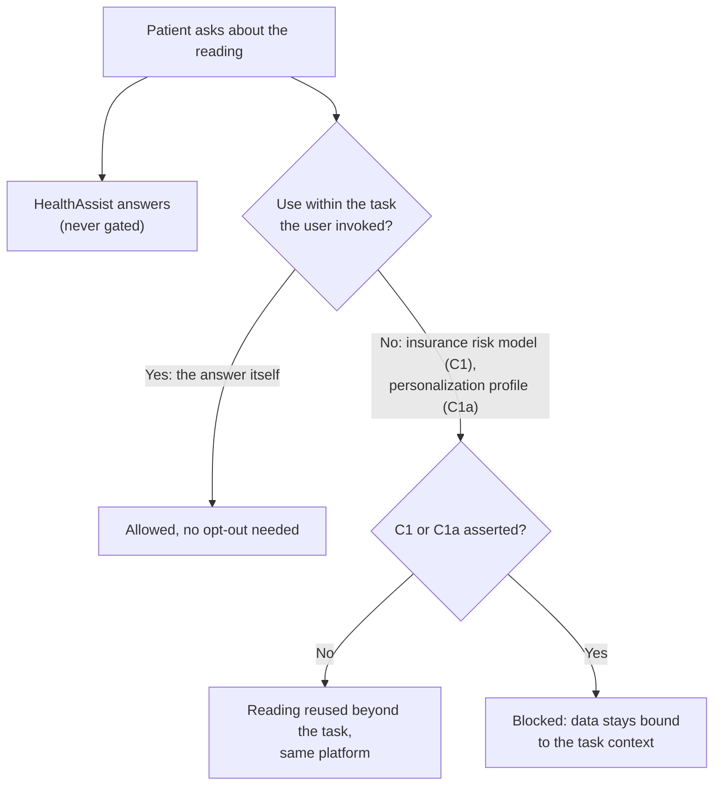
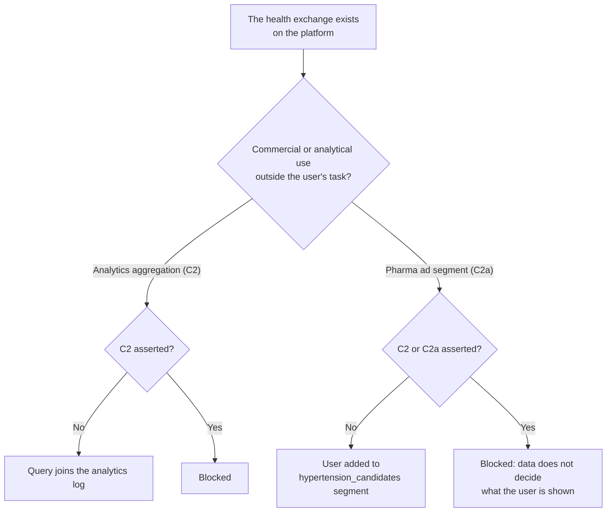
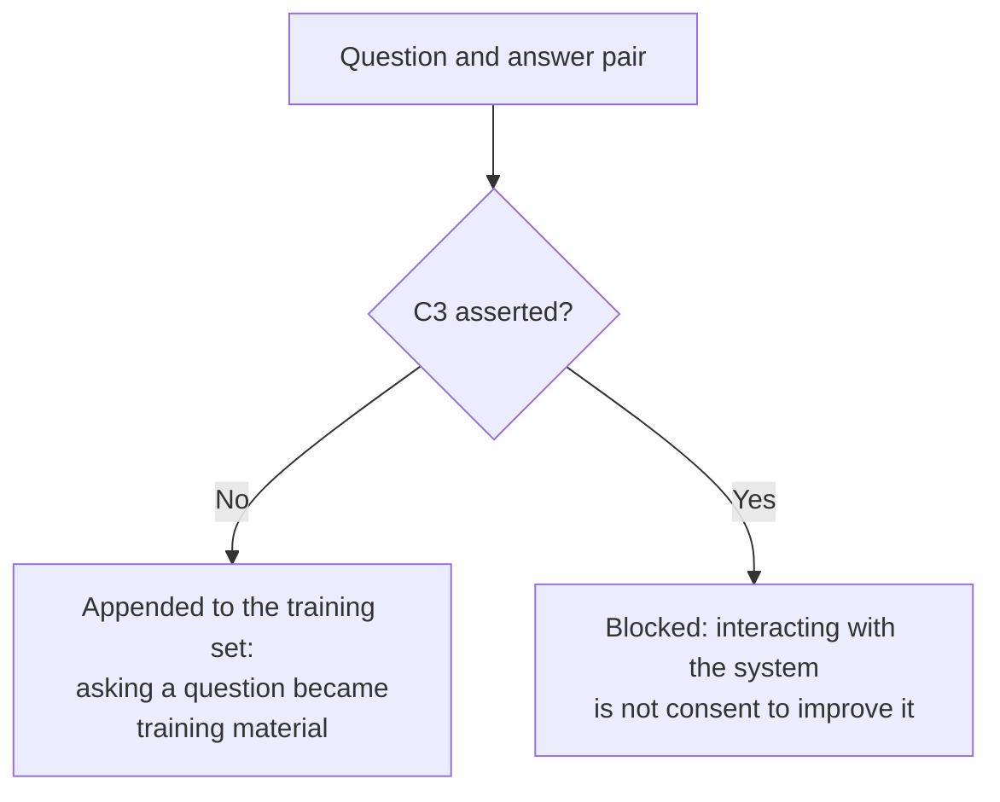
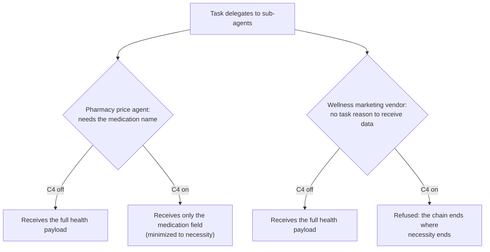

# Category C: Use

Opting out of what collected data is used for.

This prototype targets Category C of the opt-out typology and its subtypes, no more, no less:

| Subtype | Governs | In this prototype |
|---------|---------|-------------------|
| C1 (primary use) | Data stays bound to the task it was collected for, even inside the same platform. | An insurance risk assessment tries to reuse the blood pressure reading. |
| C1a (personalization) | Responses may not be tailored from inferred preferences. Sub-subtype: asserting C1 asserts C1a. | A personalization profile tries to record an inferred interest in cardiovascular content. |
| C2 (secondary use) | No advertising, cross-site profiling, or analytics unrelated to the task. | An analytics pipeline aggregates the health query. |
| C2a (targeting) | Data may not decide what content or offers the user sees. Sub-subtype: asserting C2 asserts C2a. | A pharma ad queue adds the user to a hypertension segment. |
| C3 (repurposing) | Data may not train, fine-tune, improve, or evaluate models. | The exchange is appended to a training dataset. |
| C4 (sharing) | Data may not travel further along the task's agent chain than strictly necessary. | A pharmacy price agent needs only the medication name; a wellness marketing vendor wants the full health context. |

## Scenario

A patient asks HealthAssist what a 158/96 blood pressure reading means. The answer comes back in every mode; Category C never gates the task. The boundary between permitted and restricted use is context, following contextual integrity: a patient asking about a reading has not consented to insurance processing, ad targeting, model training, or onward sharing. Around the one answer, the platform attempts five downstream uses and the task's sub-agent chain runs two hops.

## C1 and C1a flow: primary use and personalization



## C2 and C2a flow: secondary use and targeting



## C3 flow: repurposing



## C4 flow: sharing along the task chain



## How enforcement works

Every downstream attempt goes through [use_gate.js](use_gate.js):

1. `resolveOptouts()` turns the signal into the active set: bare GPC asserts all six subtypes, a `--scope` list asserts a subset, and parents expand to their sub-subtypes (c1 implies c1a, c2 implies c2a, never the reverse).
2. `checkUse()` gates the five platform uses. The primary answer carries `subtype: null` and always passes. A blocked use records what it would have written.
3. `transferAlongChain()` gates the two hops. With C4 asserted, the necessary hop is minimized to its declared required fields and the unnecessary hop is refused with the payload it would have received.

## Setup

```bash
npm install
```

The scripted paths need nothing else. The live agent path needs Ollama running locally (`ollama serve`, `ollama pull qwen2.5:14b`; override with `OLLAMA_MODEL`).

## Demo

| Command | What it shows |
|---------|---------------|
| `npm run baseline` | One health question feeds insurance, personalization, analytics, ads, training, and two full-payload transfers. |
| `npm run optout:full` | Bare GPC: the answer is unchanged, all five uses blocked, the chain minimized to one medication-only transfer. |
| `npm run optout:c1` | Insurance reuse and personalization blocked (c1 implies c1a); analytics, ads, training, and the chain still flow. |
| `npm run optout:c2a` | Only the ad queue is blocked; analytics still runs. |
| `npm run optout:c3` | Only the training append is blocked. |
| `npm run optout:c4` | Platform uses run, but the chain is minimized and the vendor hop refused. |
| `npm run demo` | All of the above in sequence. |

Live agent versions (a real model writes the answer; the platform attempts every use around it):

```bash
npm run agent        # no opt-outs
npm run agent:gpc    # whole category asserted
npm run agent:c4     # chain minimization only
```

## Tests

```bash
npm test
```

The suites cover the gate (subtype resolution with the two parent-child implications, each use surface, chain minimization and refusal), full orchestrated sessions in every mode, and the agent tool boundary.

## What it prevents

Collected data leaving its task context: same-platform reuse (C1), preference tailoring (C1a), analytics (C2), targeting (C2a), training (C3), and over-broad travel along the task's own agent chain (C4).

## What it does not prevent

The AI being present (Category A), the collection itself (Category B), how long data survives (Category D), or what an agent decides on the user's behalf (Category E).
