# Mermaid source

The same 18 figures as [opt-out-typology.drawio](opt-out-typology.drawio), in Mermaid.

To put one into a draw.io page: Extras > Insert > Advanced > Mermaid, paste the block, and pick Image rather than Diagram. They also render as is in a README or on GitHub.

Generated from [diagrams.js](diagrams.js) by [mermaid.js](mermaid.js). Edit the spec and rerun `node mermaid.js` rather than editing these by hand.

## Category A

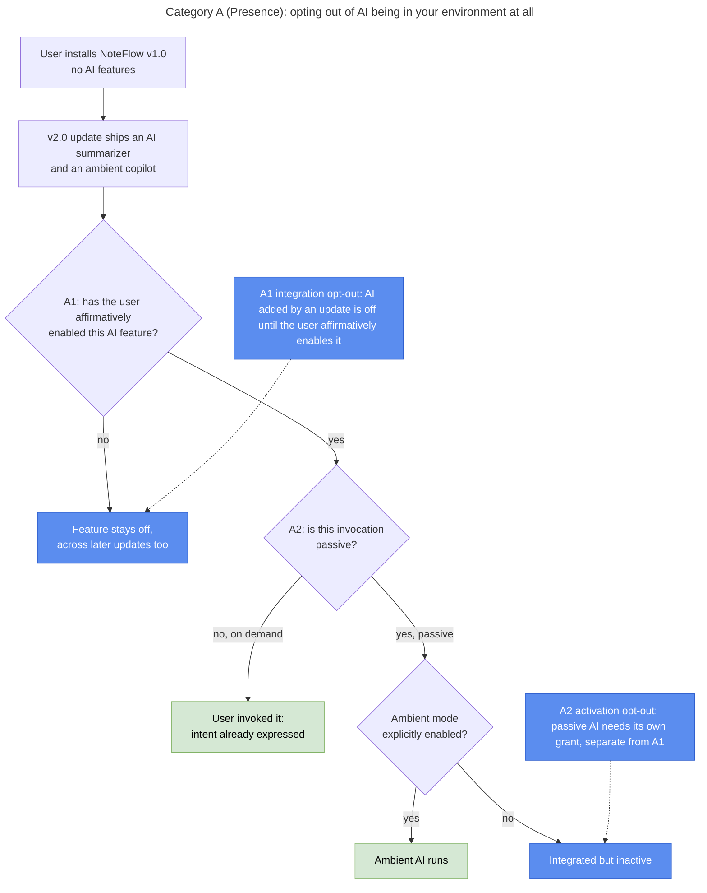
```mermaid
---
title: "Category A (Presence): opting out of AI being in your environment at all"
---
flowchart TD
    install["User installs NoteFlow v1.0\nno AI features"]
    update["v2.0 update ships an AI summarizer\nand an ambient copilot"]
    a1q{"A1: has the user affirmatively\nenabled this AI feature?"}
    a1off["Feature stays off,\nacross later updates too"]
    a2q{"A2: is this invocation\npassive?"}
    ondemand["User invoked it:\nintent already expressed"]
    ambq{"Ambient mode\nexplicitly enabled?"}
    ambon["Ambient AI runs"]
    amboff["Integrated but inactive"]

    install --> update
    update --> a1q
    a1q -- "no" --> a1off
    a1q -- "yes" --> a2q
    a2q -- "no, on demand" --> ondemand
    a2q -- "yes, passive" --> ambq
    ambq -- "yes" --> ambon
    ambq -- "no" --> amboff

    classDef category fill:#5b8def,stroke:#2f5fce,color:#fff
    classDef respected fill:#d5e8d4,stroke:#82b366,color:#000
    classDef violated fill:#f8cecc,stroke:#b85450,color:#000
    class a1off,amboff category
    class ondemand,ambon respected
    note1_a1off["A1 integration opt-out: AI added by an update is off until the user affirmatively enables it"]:::category -.-> a1off
    note2_amboff["A2 activation opt-out: passive AI needs its own grant, separate from A1"]:::category -.-> amboff
```

## A1 Integration

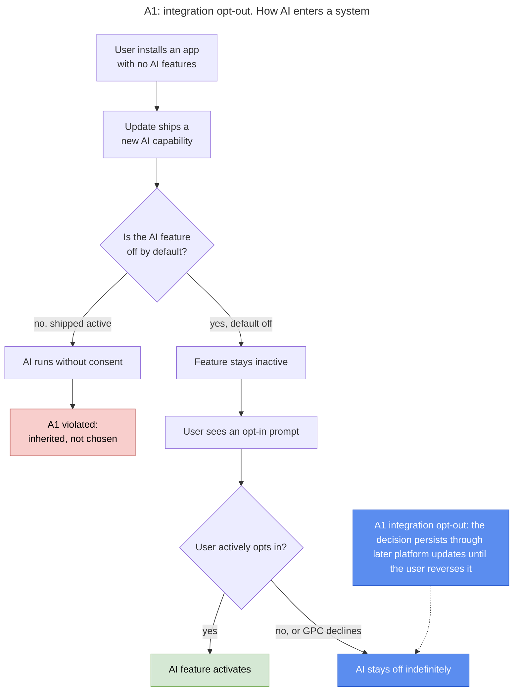
```mermaid
---
title: "A1: integration opt-out. How AI enters a system"
---
flowchart TD
    install["User installs an app\nwith no AI features"]
    update["Update ships a\nnew AI capability"]
    q{"Is the AI feature\noff by default?"}
    active["AI runs without consent"]
    viol["A1 violated:\ninherited, not chosen"]
    inactive["Feature stays inactive"]
    prompt["User sees an opt-in prompt"]
    optin{"User actively opts in?"}
    on["AI feature activates"]
    off["AI stays off indefinitely"]

    install --> update
    update --> q
    q -- "no, shipped active" --> active
    active --> viol
    q -- "yes, default off" --> inactive
    inactive --> prompt
    prompt --> optin
    optin -- "yes" --> on
    optin -- "no, or GPC declines" --> off

    classDef category fill:#5b8def,stroke:#2f5fce,color:#fff
    classDef respected fill:#d5e8d4,stroke:#82b366,color:#000
    classDef violated fill:#f8cecc,stroke:#b85450,color:#000
    class off category
    class on respected
    class viol violated
    note1_off["A1 integration opt-out: the decision persists through later platform updates until the user reverses it"]:::category -.-> off
```

## A2 Activation

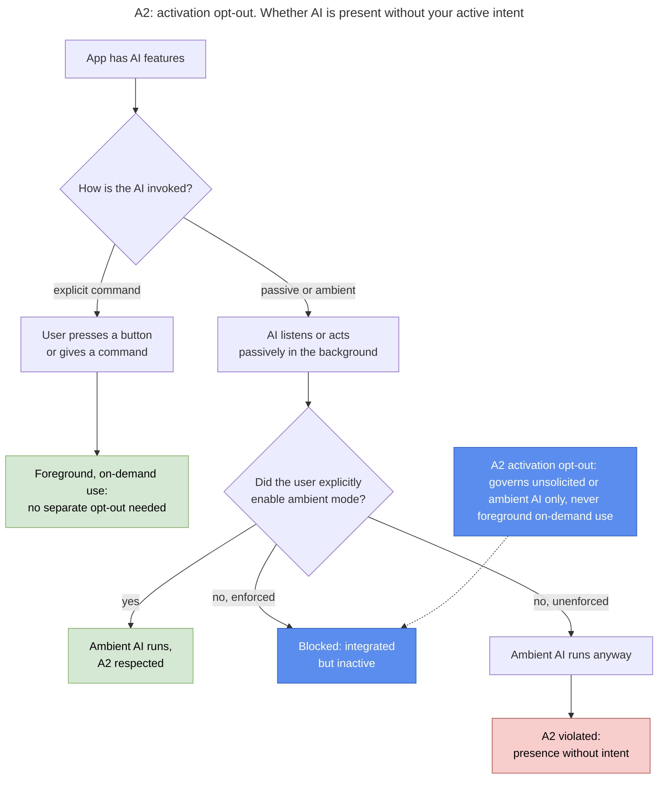
```mermaid
---
title: "A2: activation opt-out. Whether AI is present without your active intent"
---
flowchart TD
    device["App has AI features"]
    how{"How is the AI invoked?"}
    fg["User presses a button\nor gives a command"]
    fgok["Foreground, on-demand use:\nno separate opt-out needed"]
    passive["AI listens or acts\npassively in the background"]
    ambq{"Did the user explicitly\nenable ambient mode?"}
    ambok["Ambient AI runs,\nA2 respected"]
    blocked["Blocked: integrated\nbut inactive"]
    anyway["Ambient AI runs anyway"]
    viol["A2 violated:\npresence without intent"]

    device --> how
    how -- "explicit command" --> fg
    fg --> fgok
    how -- "passive or ambient" --> passive
    passive --> ambq
    ambq -- "yes" --> ambok
    ambq -- "no, enforced" --> blocked
    ambq -- "no, unenforced" --> anyway
    anyway --> viol

    classDef category fill:#5b8def,stroke:#2f5fce,color:#fff
    classDef respected fill:#d5e8d4,stroke:#82b366,color:#000
    classDef violated fill:#f8cecc,stroke:#b85450,color:#000
    class blocked category
    class fgok,ambok respected
    class viol violated
    note1_blocked["A2 activation opt-out: governs unsolicited or ambient AI only, never foreground on-demand use"]:::category -.-> blocked
```

## Category B

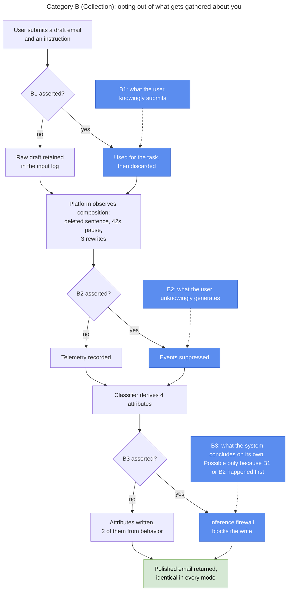
```mermaid
---
title: "Category B (Collection): opting out of what gets gathered about you"
---
flowchart TD
    submit["User submits a draft email\nand an instruction"]
    b1q{"B1 asserted?"}
    b1keep["Raw draft retained\nin the input log"]
    b1drop["Used for the task,\nthen discarded"]
    tele["Platform observes composition:\ndeleted sentence, 42s pause,\n3 rewrites"]
    b2q{"B2 asserted?"}
    b2keep["Telemetry recorded"]
    b2drop["Events suppressed"]
    cls["Classifier derives 4 attributes"]
    b3q{"B3 asserted?"}
    b3keep["Attributes written,\n2 of them from behavior"]
    b3drop["Inference firewall\nblocks the write"]
    ans["Polished email returned,\nidentical in every mode"]

    submit --> b1q
    b1q -- "no" --> b1keep
    b1q -- "yes" --> b1drop
    b1keep --> tele
    b1drop --> tele
    tele --> b2q
    b2q -- "no" --> b2keep
    b2q -- "yes" --> b2drop
    b2keep --> cls
    b2drop --> cls
    cls --> b3q
    b3q -- "no" --> b3keep
    b3q -- "yes" --> b3drop
    b3keep --> ans
    b3drop --> ans

    classDef category fill:#5b8def,stroke:#2f5fce,color:#fff
    classDef respected fill:#d5e8d4,stroke:#82b366,color:#000
    classDef violated fill:#f8cecc,stroke:#b85450,color:#000
    class b1drop,b2drop,b3drop category
    class ans respected
    note1_b1drop["B1: what the user knowingly submits"]:::category -.-> b1drop
    note2_b2drop["B2: what the user unknowingly generates"]:::category -.-> b2drop
    note3_b3drop["B3: what the system concludes on its own. Possible only because B1 or B2 happened first"]:::category -.-> b3drop
```

## B1 Input

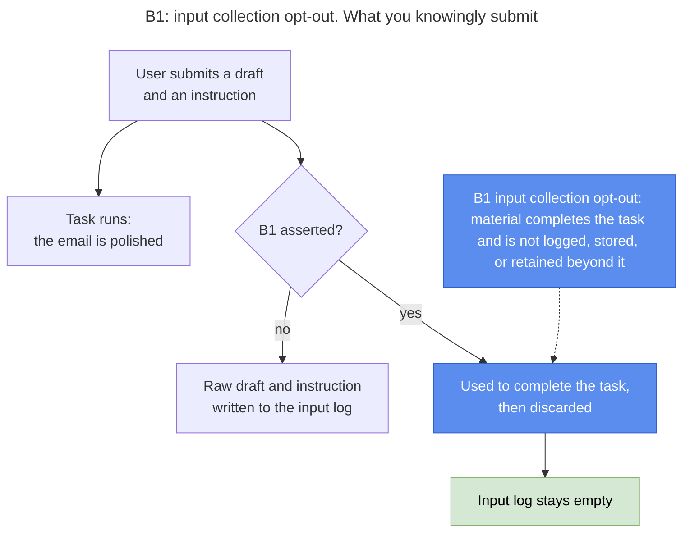
```mermaid
---
title: "B1: input collection opt-out. What you knowingly submit"
---
flowchart TD
    submit["User submits a draft\nand an instruction"]
    task["Task runs:\nthe email is polished"]
    q{"B1 asserted?"}
    log["Raw draft and instruction\nwritten to the input log"]
    drop["Used to complete the task,\nthen discarded"]
    empty["Input log stays empty"]

    submit --> task
    submit --> q
    q -- "no" --> log
    q -- "yes" --> drop
    drop --> empty

    classDef category fill:#5b8def,stroke:#2f5fce,color:#fff
    classDef respected fill:#d5e8d4,stroke:#82b366,color:#000
    classDef violated fill:#f8cecc,stroke:#b85450,color:#000
    class drop category
    class empty respected
    note1_drop["B1 input collection opt-out: material completes the task and is not logged, stored, or retained beyond it"]:::category -.-> drop
```

## B2 Behavioral

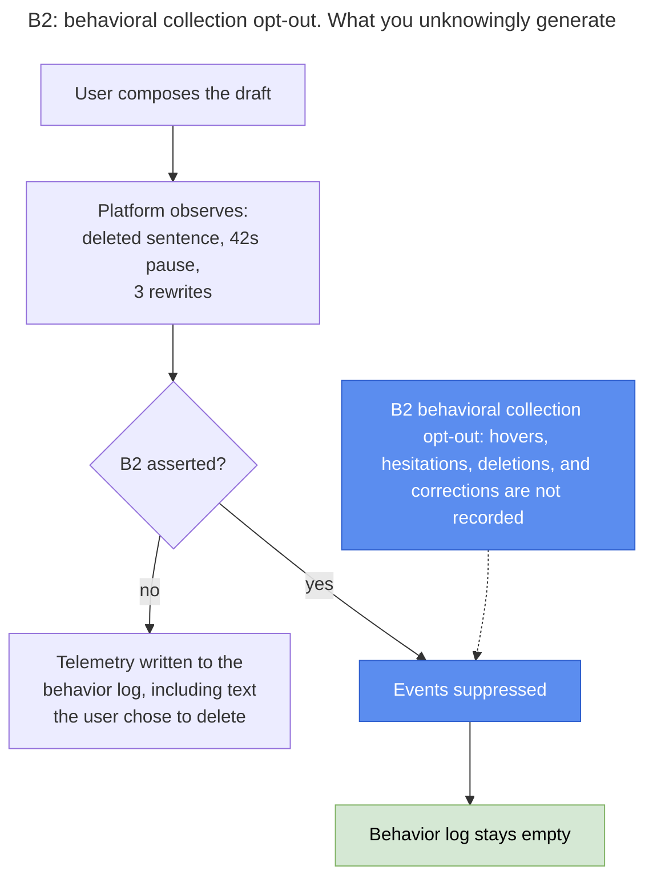
```mermaid
---
title: "B2: behavioral collection opt-out. What you unknowingly generate"
---
flowchart TD
    compose["User composes the draft"]
    observe["Platform observes:\ndeleted sentence, 42s pause,\n3 rewrites"]
    q{"B2 asserted?"}
    rec["Telemetry written to the\nbehavior log, including text\nthe user chose to delete"]
    sup["Events suppressed"]
    empty["Behavior log stays empty"]

    compose --> observe
    observe --> q
    q -- "no" --> rec
    q -- "yes" --> sup
    sup --> empty

    classDef category fill:#5b8def,stroke:#2f5fce,color:#fff
    classDef respected fill:#d5e8d4,stroke:#82b366,color:#000
    classDef violated fill:#f8cecc,stroke:#b85450,color:#000
    class sup category
    class empty respected
    note1_sup["B2 behavioral collection opt-out: hovers, hesitations, deletions, and corrections are not recorded"]:::category -.-> sup
```

## B3 Derived

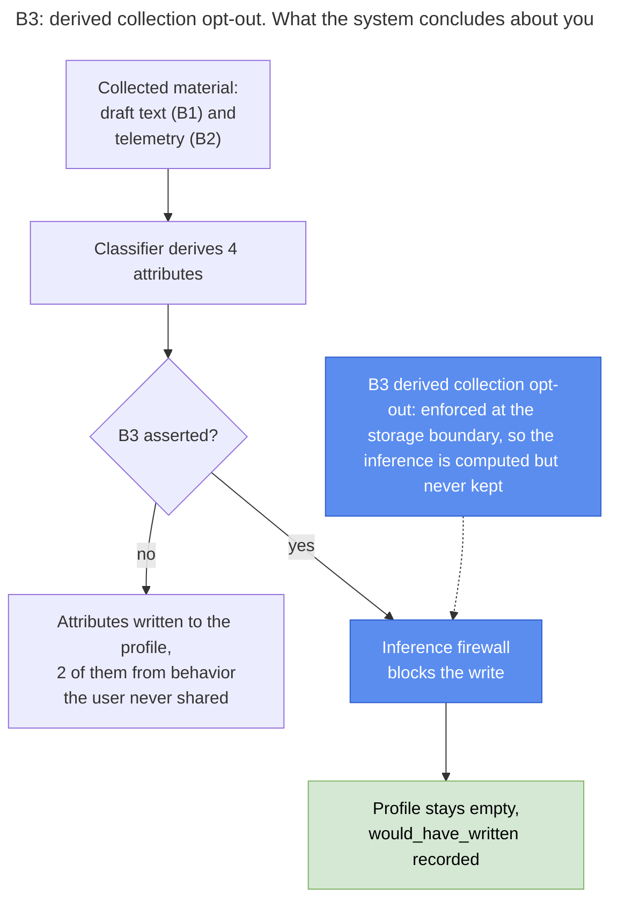
```mermaid
---
title: "B3: derived collection opt-out. What the system concludes about you"
---
flowchart TD
    mat["Collected material:\ndraft text (B1) and\ntelemetry (B2)"]
    cls["Classifier derives 4 attributes"]
    q{"B3 asserted?"}
    write["Attributes written to the profile,\n2 of them from behavior\nthe user never shared"]
    fw["Inference firewall\nblocks the write"]
    audit["Profile stays empty,\nwould_have_written recorded"]

    mat --> cls
    cls --> q
    q -- "no" --> write
    q -- "yes" --> fw
    fw --> audit

    classDef category fill:#5b8def,stroke:#2f5fce,color:#fff
    classDef respected fill:#d5e8d4,stroke:#82b366,color:#000
    classDef violated fill:#f8cecc,stroke:#b85450,color:#000
    class fw category
    class audit respected
    note1_fw["B3 derived collection opt-out: enforced at the storage boundary, so the inference is computed but never kept"]:::category -.-> fw
```

## Category C

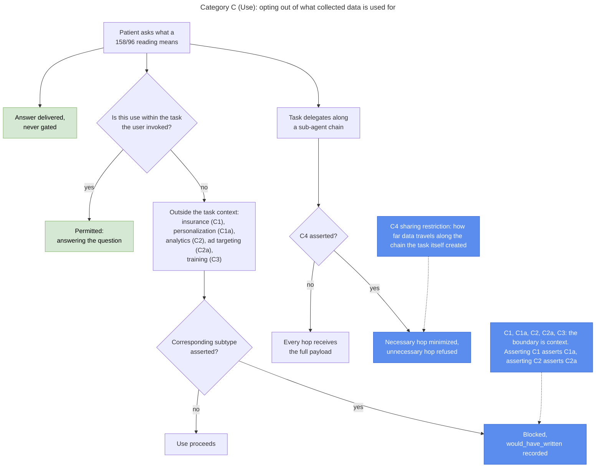
```mermaid
---
title: "Category C (Use): opting out of what collected data is used for"
---
flowchart TD
    ask["Patient asks what a\n158/96 reading means"]
    ans["Answer delivered,\nnever gated"]
    scope{"Is this use within the task\nthe user invoked?"}
    inscope["Permitted:\nanswering the question"]
    out["Outside the task context:\ninsurance (C1), personalization (C1a),\nanalytics (C2), ad targeting (C2a),\ntraining (C3)"]
    gate{"Corresponding subtype\nasserted?"}
    runs["Use proceeds"]
    blocked["Blocked,\nwould_have_written recorded"]
    chain["Task delegates along\na sub-agent chain"]
    c4q{"C4 asserted?"}
    full["Every hop receives\nthe full payload"]
    min["Necessary hop minimized,\nunnecessary hop refused"]

    ask --> ans
    ask --> scope
    scope -- "yes" --> inscope
    scope -- "no" --> out
    out --> gate
    gate -- "no" --> runs
    gate -- "yes" --> blocked
    ask --> chain
    chain --> c4q
    c4q -- "no" --> full
    c4q -- "yes" --> min

    classDef category fill:#5b8def,stroke:#2f5fce,color:#fff
    classDef respected fill:#d5e8d4,stroke:#82b366,color:#000
    classDef violated fill:#f8cecc,stroke:#b85450,color:#000
    class blocked,min category
    class ans,inscope respected
    note1_blocked["C1, C1a, C2, C2a, C3: the boundary is context. Asserting C1 asserts C1a, asserting C2 asserts C2a"]:::category -.-> blocked
    note2_min["C4 sharing restriction: how far data travels along the chain the task itself created"]:::category -.-> min
```

## C1 Primary use

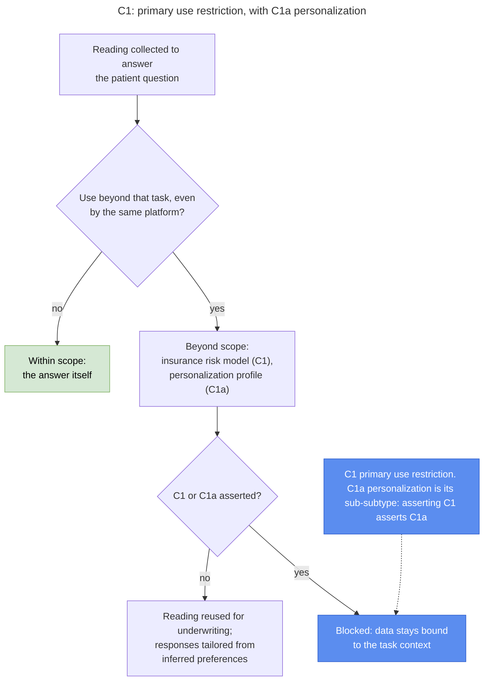
```mermaid
---
title: "C1: primary use restriction, with C1a personalization"
---
flowchart TD
    data["Reading collected to answer\nthe patient question"]
    q{"Use beyond that task, even\nby the same platform?"}
    within["Within scope:\nthe answer itself"]
    beyond["Beyond scope:\ninsurance risk model (C1),\npersonalization profile (C1a)"]
    gate{"C1 or C1a asserted?"}
    reuse["Reading reused for underwriting;\nresponses tailored from\ninferred preferences"]
    blocked["Blocked: data stays bound\nto the task context"]

    data --> q
    q -- "no" --> within
    q -- "yes" --> beyond
    beyond --> gate
    gate -- "no" --> reuse
    gate -- "yes" --> blocked

    classDef category fill:#5b8def,stroke:#2f5fce,color:#fff
    classDef respected fill:#d5e8d4,stroke:#82b366,color:#000
    classDef violated fill:#f8cecc,stroke:#b85450,color:#000
    class blocked category
    class within respected
    note1_blocked["C1 primary use restriction. C1a personalization is its sub-subtype: asserting C1 asserts C1a"]:::category -.-> blocked
```

## C2 Secondary use

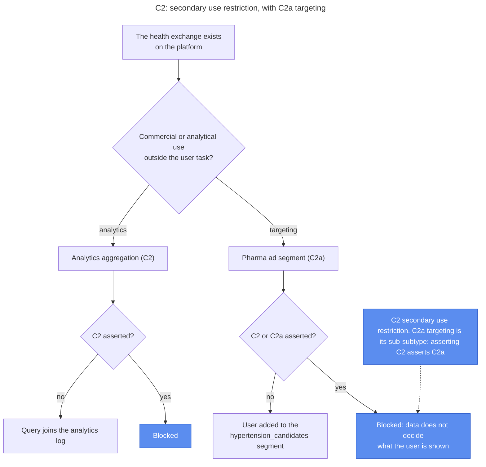
```mermaid
---
title: "C2: secondary use restriction, with C2a targeting"
---
flowchart TD
    ex["The health exchange exists\non the platform"]
    q{"Commercial or analytical use\noutside the user task?"}
    an["Analytics aggregation (C2)"]
    ad["Pharma ad segment (C2a)"]
    g1{"C2 asserted?"}
    g2{"C2 or C2a asserted?"}
    log["Query joins the analytics log"]
    bl1["Blocked"]
    targ["User added to the\nhypertension_candidates segment"]
    bl2["Blocked: data does not decide\nwhat the user is shown"]

    ex --> q
    q -- "analytics" --> an
    q -- "targeting" --> ad
    an --> g1
    ad --> g2
    g1 -- "no" --> log
    g1 -- "yes" --> bl1
    g2 -- "no" --> targ
    g2 -- "yes" --> bl2

    classDef category fill:#5b8def,stroke:#2f5fce,color:#fff
    classDef respected fill:#d5e8d4,stroke:#82b366,color:#000
    classDef violated fill:#f8cecc,stroke:#b85450,color:#000
    class bl1,bl2 category
    note1_bl2["C2 secondary use restriction. C2a targeting is its sub-subtype: asserting C2 asserts C2a"]:::category -.-> bl2
```

## C3 Repurposing

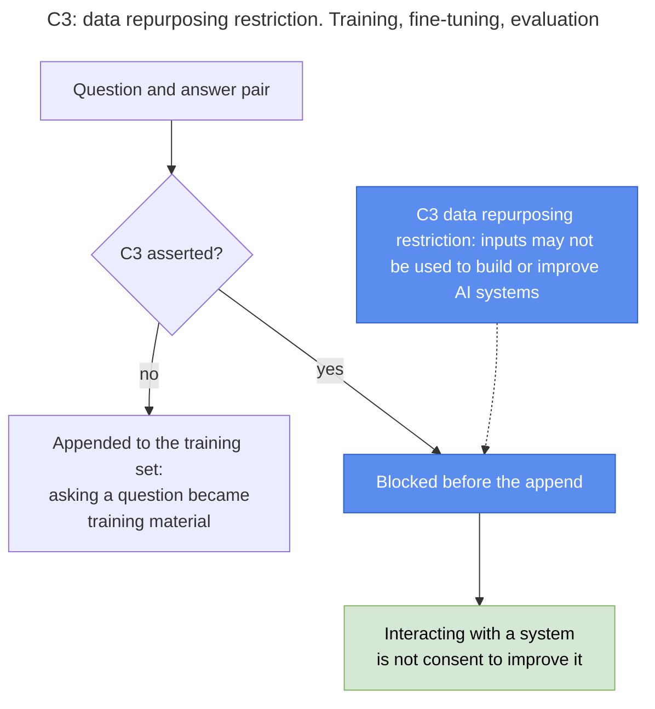
```mermaid
---
title: "C3: data repurposing restriction. Training, fine-tuning, evaluation"
---
flowchart TD
    pair["Question and answer pair"]
    q{"C3 asserted?"}
    train["Appended to the training set:\nasking a question became\ntraining material"]
    blocked["Blocked before the append"]
    ok["Interacting with a system\nis not consent to improve it"]

    pair --> q
    q -- "no" --> train
    q -- "yes" --> blocked
    blocked --> ok

    classDef category fill:#5b8def,stroke:#2f5fce,color:#fff
    classDef respected fill:#d5e8d4,stroke:#82b366,color:#000
    classDef violated fill:#f8cecc,stroke:#b85450,color:#000
    class blocked category
    class ok respected
    note1_blocked["C3 data repurposing restriction: inputs may not be used to build or improve AI systems"]:::category -.-> blocked
```

## C4 Sharing

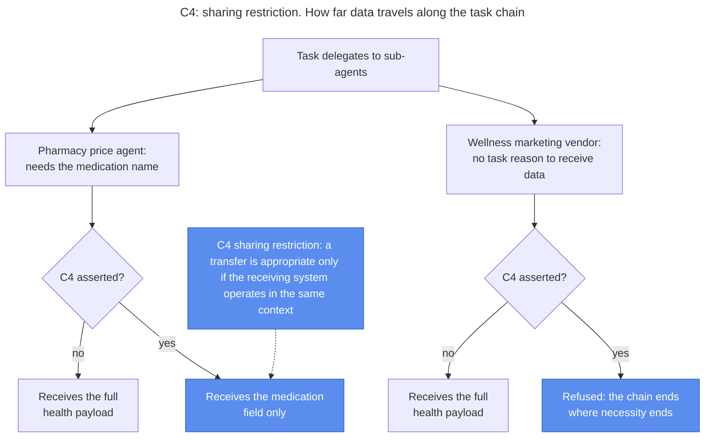
```mermaid
---
title: "C4: sharing restriction. How far data travels along the task chain"
---
flowchart TD
    del["Task delegates to sub-agents"]
    h1["Pharmacy price agent:\nneeds the medication name"]
    h2["Wellness marketing vendor:\nno task reason to receive data"]
    q1{"C4 asserted?"}
    q2{"C4 asserted?"}
    f1["Receives the full\nhealth payload"]
    m1["Receives the medication\nfield only"]
    f2["Receives the full\nhealth payload"]
    r2["Refused: the chain ends\nwhere necessity ends"]

    del --> h1
    del --> h2
    h1 --> q1
    h2 --> q2
    q1 -- "no" --> f1
    q1 -- "yes" --> m1
    q2 -- "no" --> f2
    q2 -- "yes" --> r2

    classDef category fill:#5b8def,stroke:#2f5fce,color:#fff
    classDef respected fill:#d5e8d4,stroke:#82b366,color:#000
    classDef violated fill:#f8cecc,stroke:#b85450,color:#000
    class m1,r2 category
    note1_m1["C4 sharing restriction: a transfer is appropriate only if the receiving system operates in the same context"]:::category -.-> m1
```

## Category D

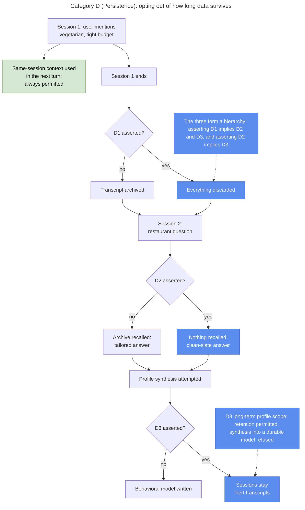
```mermaid
---
title: "Category D (Persistence): opting out of how long data survives"
---
flowchart TD
    s1["Session 1: user mentions\nvegetarian, tight budget"]
    within["Same-session context used\nin the next turn:\nalways permitted"]
    n_end["Session 1 ends"]
    d1q{"D1 asserted?"}
    arch["Transcript archived"]
    disc["Everything discarded"]
    s2["Session 2:\nrestaurant question"]
    d2q{"D2 asserted?"}
    recall["Archive recalled:\ntailored answer"]
    fresh["Nothing recalled:\nclean-slate answer"]
    syn["Profile synthesis attempted"]
    d3q{"D3 asserted?"}
    model["Behavioral model written"]
    inert["Sessions stay\ninert transcripts"]

    s1 --> within
    s1 --> n_end
    n_end --> d1q
    d1q -- "no" --> arch
    d1q -- "yes" --> disc
    arch --> s2
    disc --> s2
    s2 --> d2q
    d2q -- "no" --> recall
    d2q -- "yes" --> fresh
    recall --> syn
    fresh --> syn
    syn --> d3q
    d3q -- "no" --> model
    d3q -- "yes" --> inert

    classDef category fill:#5b8def,stroke:#2f5fce,color:#fff
    classDef respected fill:#d5e8d4,stroke:#82b366,color:#000
    classDef violated fill:#f8cecc,stroke:#b85450,color:#000
    class disc,fresh,inert category
    class within respected
    note1_disc["The three form a hierarchy: asserting D1 implies D2 and D3, and asserting D2 implies D3"]:::category -.-> disc
    note2_inert["D3 long-term profile scope: retention permitted, synthesis into a durable model refused"]:::category -.-> inert
```

## D1 Session

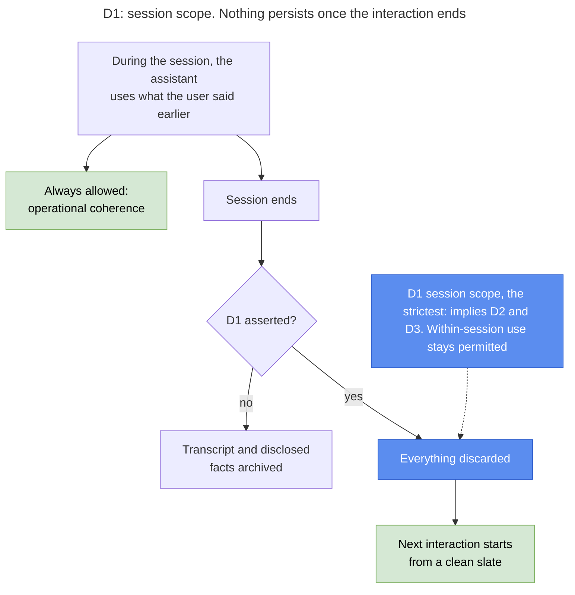
```mermaid
---
title: "D1: session scope. Nothing persists once the interaction ends"
---
flowchart TD
    within["During the session, the assistant\nuses what the user said earlier"]
    coh["Always allowed:\noperational coherence"]
    ends["Session ends"]
    q{"D1 asserted?"}
    arch["Transcript and disclosed\nfacts archived"]
    disc["Everything discarded"]
    clean["Next interaction starts\nfrom a clean slate"]

    within --> coh
    within --> ends
    ends --> q
    q -- "no" --> arch
    q -- "yes" --> disc
    disc --> clean

    classDef category fill:#5b8def,stroke:#2f5fce,color:#fff
    classDef respected fill:#d5e8d4,stroke:#82b366,color:#000
    classDef violated fill:#f8cecc,stroke:#b85450,color:#000
    class disc category
    class coh,clean respected
    note1_disc["D1 session scope, the strictest: implies D2 and D3. Within-session use stays permitted"]:::category -.-> disc
```

## D2 Cross-session

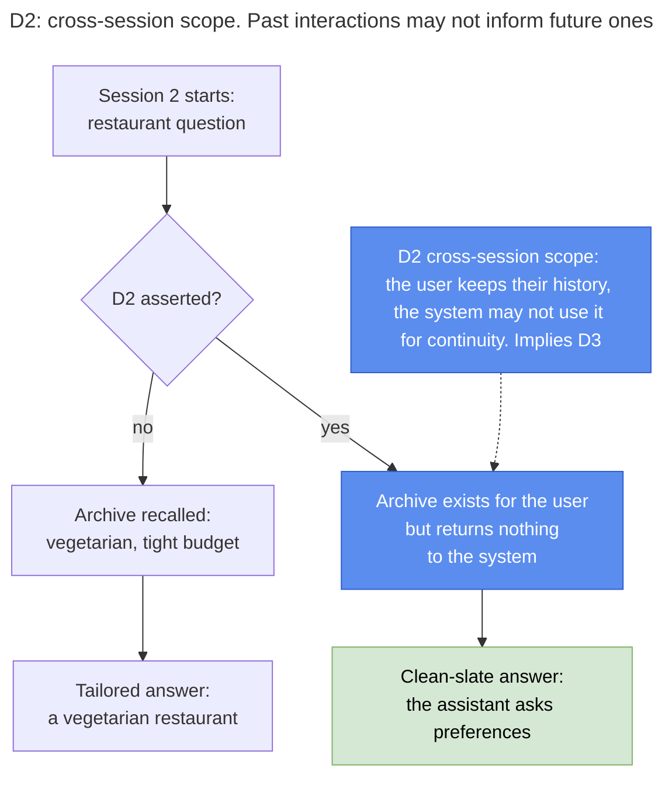
```mermaid
---
title: "D2: cross-session scope. Past interactions may not inform future ones"
---
flowchart TD
    new["Session 2 starts:\nrestaurant question"]
    q{"D2 asserted?"}
    rec["Archive recalled:\nvegetarian, tight budget"]
    tail["Tailored answer:\na vegetarian restaurant"]
    fresh["Archive exists for the user\nbut returns nothing\nto the system"]
    gen["Clean-slate answer:\nthe assistant asks preferences"]

    new --> q
    q -- "no" --> rec
    rec --> tail
    q -- "yes" --> fresh
    fresh --> gen

    classDef category fill:#5b8def,stroke:#2f5fce,color:#fff
    classDef respected fill:#d5e8d4,stroke:#82b366,color:#000
    classDef violated fill:#f8cecc,stroke:#b85450,color:#000
    class fresh category
    class gen respected
    note1_fresh["D2 cross-session scope: the user keeps their history, the system may not use it for continuity. Implies D3"]:::category -.-> fresh
```

## D3 Profile

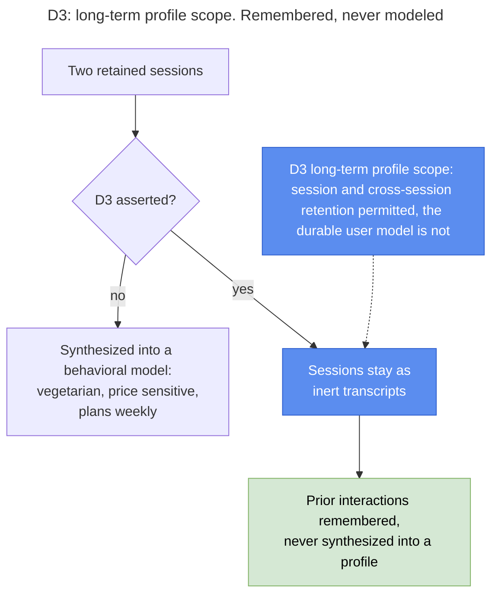
```mermaid
---
title: "D3: long-term profile scope. Remembered, never modeled"
---
flowchart TD
    arch["Two retained sessions"]
    q{"D3 asserted?"}
    model["Synthesized into a behavioral model:\nvegetarian, price sensitive,\nplans weekly"]
    inert["Sessions stay as\ninert transcripts"]
    rem["Prior interactions remembered,\nnever synthesized into a profile"]

    arch --> q
    q -- "no" --> model
    q -- "yes" --> inert
    inert --> rem

    classDef category fill:#5b8def,stroke:#2f5fce,color:#fff
    classDef respected fill:#d5e8d4,stroke:#82b366,color:#000
    classDef violated fill:#f8cecc,stroke:#b85450,color:#000
    class inert category
    class rem respected
    note1_inert["D3 long-term profile scope: session and cross-session retention permitted, the durable user model is not"]:::category -.-> inert
```

## Category E

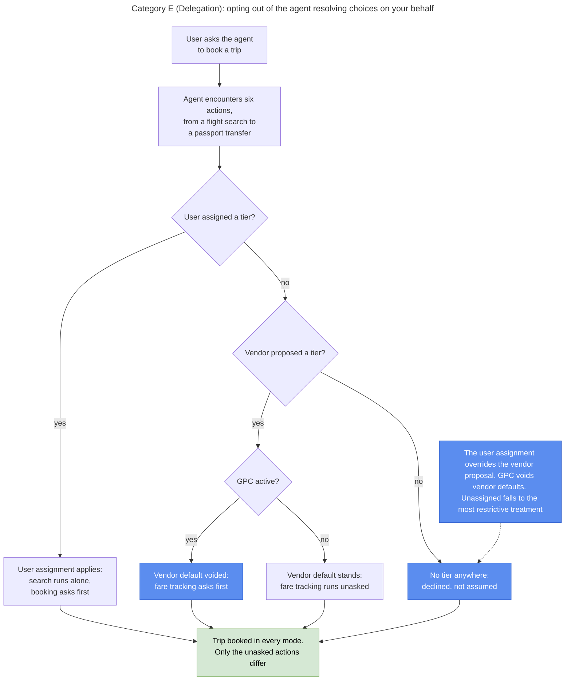
```mermaid
---
title: "Category E (Delegation): opting out of the agent resolving choices on your behalf"
---
flowchart TD
    req["User asks the agent\nto book a trip"]
    enc["Agent encounters six actions,\nfrom a flight search to\na passport transfer"]
    ua{"User assigned a tier?"}
    userwins["User assignment applies:\nsearch runs alone,\nbooking asks first"]
    vd{"Vendor proposed a tier?"}
    gpcq{"GPC active?"}
    vdauto["Vendor default stands:\nfare tracking runs unasked"]
    voided["Vendor default voided:\nfare tracking asks first"]
    none["No tier anywhere:\ndeclined, not assumed"]
    out["Trip booked in every mode.\nOnly the unasked actions differ"]

    req --> enc
    enc --> ua
    ua -- "yes" --> userwins
    ua -- "no" --> vd
    vd -- "yes" --> gpcq
    vd -- "no" --> none
    gpcq -- "yes" --> voided
    gpcq -- "no" --> vdauto
    userwins --> out
    voided --> out
    vdauto --> out
    none --> out

    classDef category fill:#5b8def,stroke:#2f5fce,color:#fff
    classDef respected fill:#d5e8d4,stroke:#82b366,color:#000
    classDef violated fill:#f8cecc,stroke:#b85450,color:#000
    class voided,none category
    class out respected
    note1_none["The user assignment overrides the vendor proposal. GPC voids vendor defaults. Unassigned falls to the most restrictive treatment"]:::category -.-> none
```

## E1 Delegation

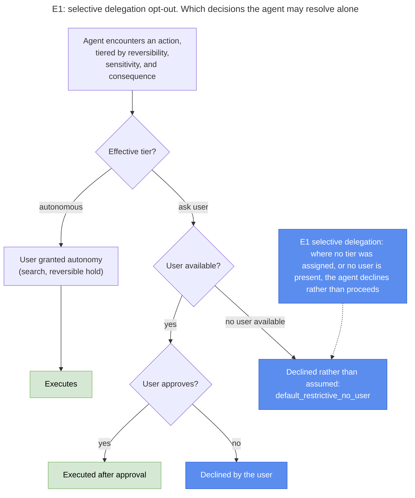
```mermaid
---
title: "E1: selective delegation opt-out. Which decisions the agent may resolve alone"
---
flowchart TD
    act["Agent encounters an action,\ntiered by reversibility,\nsensitivity, and consequence"]
    tier{"Effective tier?"}
    auto["User granted autonomy\n(search, reversible hold)"]
    exec["Executes"]
    p{"User available?"}
    appr{"User approves?"}
    ok["Executed after approval"]
    no["Declined by the user"]
    dec["Declined rather than assumed:\ndefault_restrictive_no_user"]

    act --> tier
    tier -- "autonomous" --> auto
    auto --> exec
    tier -- "ask user" --> p
    p -- "yes" --> appr
    appr -- "yes" --> ok
    appr -- "no" --> no
    p -- "no user available" --> dec

    classDef category fill:#5b8def,stroke:#2f5fce,color:#fff
    classDef respected fill:#d5e8d4,stroke:#82b366,color:#000
    classDef violated fill:#f8cecc,stroke:#b85450,color:#000
    class no,dec category
    class exec,ok respected
    note1_dec["E1 selective delegation: where no tier was assigned, or no user is present, the agent declines rather than proceeds"]:::category -.-> dec
```
