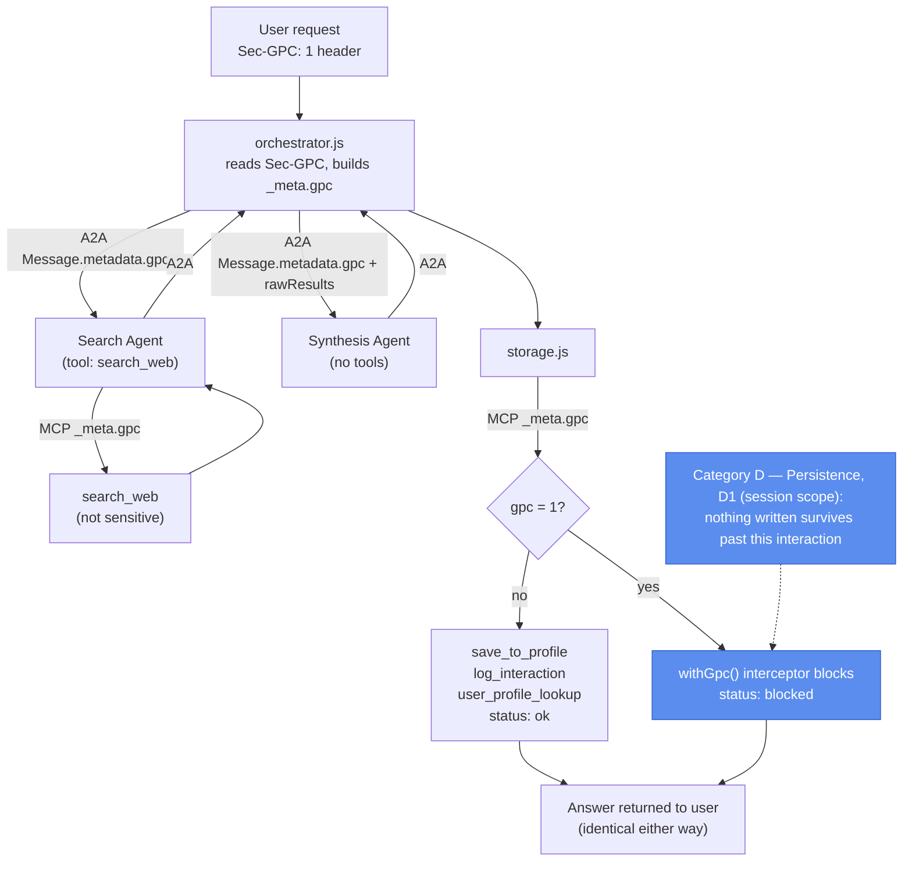

# Architecture A: GPC Enforcement in a Multi-Agent Pipeline

## What it demonstrates

A user with GPC enabled asks an AI assistant: *"Help me plan a 5-day trip to Japan: what should I see, eat, and know before I go?"*

The assistant searches the web, synthesises an itinerary, and (in a non-GPC world) saves the results to the user's profile. This request exercises two enforcement layers:

| Layer | Mechanism | Enforcement point |
|---|---|---|
| **1. Transport** | `Sec-GPC: 1` HTTP header | The orchestrator reads the header once and propagates the signal to every downstream call |
| **2. Data layer** | `withGpc()` policy interceptor | Wraps all tool handlers behind the MCP server. A sensitive-tool registry (`gpc_policy.js`) defines which tools touch personal data: `user_profile_lookup`, `save_to_profile`, and `log_interaction`. If `gpc=1` is present in `_meta` and the tool is in the registry, the interceptor returns `status: blocked` without executing. `search_web` is not in the registry and always executes. |

The GPC signal travels between layers via the MCP `_meta` envelope, which is attached to every tool call, and via the A2A `Message.metadata` envelope, which is attached to every inter-agent call.

**Result:** the user gets an equally good itinerary whether GPC is on or off. With GPC on, nothing is stored: no profile update, no interaction log entry.

---

## GPC categories depicted

Architecture A implements **Category D (Persistence)** from the opt-out typology, specifically **D1 (session scope)**. Blocking `save_to_profile`, `log_interaction`, and `user_profile_lookup` means nothing survives past the immediate interaction and no prior storage is read back, while the same-session task (search, synthesis, the answer itself) runs unaffected.



---

## Protocol compliance

Both enforcement points sit on real, spec-compliant transports rather than in-process shortcuts:

- **MCP.** `mcp-server/server.js` is a real `@modelcontextprotocol/sdk` `Server` over stdio. `orchestrator/mcp_client.js` is a real `Client` that spawns it as a child process and calls `tools/call` over the actual wire protocol; the GPC signal rides in `params._meta.gpc`, same as before.
- **A2A.** The search and synthesis agents are each served behind a real `@a2a-js/sdk` `DefaultRequestHandler`, wired into Express via the SDK's own JSON-RPC handler and agent-card handler. `orchestrator/a2a_client.js` reaches them with the SDK's `ClientFactory`. The GPC signal rides in `Message.metadata.gpc` — A2A's equivalent of MCP's `_meta`.

---

## Pipeline

```
HTTP Request (Sec-GPC: 1)
  → orchestrator.js               (reads Sec-GPC, builds _meta / A2A metadata envelope)
      → a2a_client.js  ⇄ JSON-RPC ⇄  search_agent_server.js     (LLM loop — decides how many searches to run)
      → a2a_client.js  ⇄ JSON-RPC ⇄  synthesis_agent_server.js  (LLM — reasons over raw results, calls no tools)
      → storage.js                (plain code — enforces GPC before writing)
          → mcp_client.js  ⇄ stdio ⇄  mcp-server/server.js       (tools/call — GPC-gated at the MCP layer)
  → HTTP Response
```

Each agent server and the MCP server start lazily on first request and are memoized for the life of the process; `orchestrator.shutdown()` closes them (used by tests and, if a caller wants a clean exit, by harness scripts).

### Agent roles

**Search agent** (`agents/search_agent.js`, served over A2A by `agents/search_agent_server.js`): An LLM loop with one tool (`search_web`). The model decides how many searches to make and when it has enough raw material. The GPC signal is forwarded on the A2A message (as `Message.metadata.gpc`) and again on every MCP tool call (as `_meta.gpc`), but `search_web` is not sensitive so the `withGpc()` interceptor always passes it through. Retrieval is never blocked, only storage is.

**Synthesis agent** (`agents/synthesis_agent.js`, served over A2A by `agents/synthesis_agent_server.js`): Receives raw search results from the search agent (forwarded by the orchestrator as A2A message metadata) and synthesises them into a structured itinerary. It calls no tools, so there is nothing for GPC to block here.

### Supporting services

**Storage** (`services/storage.js`): Calls three storage operations in fixed order over the real MCP client. MCP-sensitive writes are double-guarded: explicit code check plus `withGpc()` interceptor at the MCP layer.

## File map

```
prototype-1/
├── orchestrator/
│   ├── orchestrator.js     Entry point: reads Sec-GPC, builds _meta, starts/calls agent servers
│   ├── agent_loop.js       Shared LLM turn loop (tool_choice, nudge, required-tool tracking)
│   ├── mcp_client.js       Real MCP client (stdio) — spawns mcp-server/server.js, applies _meta.gpc
│   └── a2a_client.js       Real A2A client (JSON-RPC) — sends Message.metadata.gpc to agent servers
│
├── agents/
│   ├── search_agent.js              LLM search agent (tool: search_web)
│   ├── search_agent_executor.js     A2A AgentExecutor wrapping search_agent.js
│   ├── search_agent_server.js       A2A server (Express + DefaultRequestHandler) for the search agent
│   ├── synthesis_agent.js           LLM synthesis agent (no tools)
│   ├── synthesis_agent_executor.js  A2A AgentExecutor wrapping synthesis_agent.js
│   └── synthesis_agent_server.js    A2A server (Express + DefaultRequestHandler) for the synthesis agent
│
├── services/
│   └── storage.js          Storage: profile, log — GPC-gated via code + MCP
│
├── mcp-server/
│   ├── server.js           MCP server entry point (real @modelcontextprotocol/sdk Server, stdio)
│   ├── gpc_policy.js       withGpc() interceptor + sensitive-tool registry
│   └── tool_handlers.js    Raw tool implementations (search, profile, log)
│
├── harness/
│   ├── run_baseline.js     Demo run: GPC off, all tools execute
│   ├── run_gpc.js          Demo run: GPC on, sensitive tools blocked (_meta)
│   ├── compare_results.js  Diff baseline vs GPC run, print report
│   └── seed_demo.js        Seed user-42 profile and interaction log
│
├── tests/
│   ├── gpc_policy.test.js  withGpc() blocking, passthrough, signal formats
│   ├── orchestrator.test.js  Full pipeline integration; LLM agents mocked
│   └── agent_loop.test.js  LLM loop: tool_choice, nudge, arg parsing, errors
│
└── output/                 Gitignored; created at runtime
    ├── profiles.json
    ├── interaction_log.jsonl
    ├── baseline_result.json
    └── gpc_result.json
```

---

## Setup

```bash
cd prototype-1
npm install
```

---

## How to test

### Unit and integration tests (no model required)

```bash
npm test
```

LLM agents are mocked in `orchestrator.test.js` so no Ollama instance is needed. The A2A agent servers still start for real (in-process), and the MCP server still starts for real (a short-lived child process, closed in `afterAll`) — only the LLM calls inside the agents are mocked, so tool-call and message-passing behavior over the real transports is exercised as-is.

| Test file | What it covers |
|---|---|
| `gpc_policy.test.js` | `withGpc()` blocking, passthrough, all GPC signal formats (`1`, `true`, `"1"`) |
| `orchestrator.test.js` | Full pipeline: Layer 1 and 2 assertions, timing, storage tested directly |
| `agent_loop.test.js` | Shared LLM loop: `tool_choice` switching, nudge, arg parsing |

### Demo (requires Ollama)

Seeds user-42, runs baseline and GPC runs, prints comparison report:

```bash
# 1. Start Ollama (skip if desktop app is already running)
ollama serve

# 2. Pull the model once
ollama pull qwen2.5:14b

# 3. Seed demo data and run both modes
npm run demo
```

Individual runs:

```bash
npm run seed      # Seed user-42 travel history
npm run baseline  # GPC off: all tools execute, data written to output/
npm run gpc       # GPC on: sensitive tools blocked
npm run compare   # Print comparison report from existing output files
```

Override the model:

```bash
OLLAMA_MODEL=llama3.1:70b npm run demo
```

Use real web search (Tavily free tier, 1000 calls/month):

```bash
TAVILY_API_KEY=tvly-... npm run demo
```

### Expected comparison report

```
Tool                     │ Baseline     │ GPC
─────────────────────────────────────────────
search_web               │ ✓ ok         │ ✓ ok
profile_lookup           │ ✓ ok         │ ✗ BLOCKED
save_to_profile          │ ✓ ok         │ ✗ BLOCKED
log_interaction          │ ✓ ok         │ ✗ BLOCKED
```

---

## What the output files show

After running the demo, `output/` contains:

| File | Baseline | GPC run |
|---|---|---|
| `profiles.json` | user-42 record updated | unchanged (write blocked) |
| `interaction_log.jsonl` | new line appended | unchanged (write blocked) |
| `baseline_result.json` | all tools `status: ok` | n/a |
| `gpc_result.json` | n/a | storage tools `status: blocked` |
