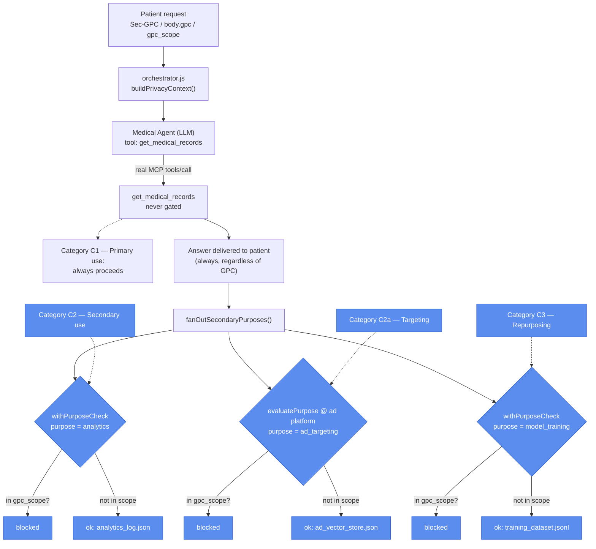

# Architecture B: Purpose-Scoped GPC Enforcement Across a Multi-Stage AI Pipeline

## What it demonstrates

A patient asks an AI assistant: *"What does my blood pressure reading mean, and should I adjust my medication?"*

The assistant retrieves their records and answers the question. In a non-GPC world, that same interaction also feeds an analytics log, a model-training dataset, and a pharma ad-targeting platform: downstream systems the patient never directly interacted with. With GPC, each of those secondary data flows is independently gated by its declared purpose.

Architecture B adds purpose-level enforcement over Architecture A's tool-level blocking. A single interaction fans out to multiple secondary pipelines; the patient can opt out of specific purposes (e.g., ad targeting) while allowing others (e.g., analytics), independently and without affecting the primary response.

| Layer | Mechanism | Enforcement point |
|---|---|---|
| **1. Transport** | `Sec-GPC: 1` HTTP header or `gpc` in request body; optional `gpc_scope` array for partial opt-out | `buildPrivacyContext()` in `orchestrator.js` reads `gpc` and `gpc_scope` once from the inbound request and builds `privacyContext = { gpc, gpc_scope }`, which is passed as a single object to `runAgentLoop()` and forwarded to every downstream call; nothing below re-reads the header |
| **2. Agent protocol** | `_meta = {gpc, gpc_scope, purpose}` task envelope | `orchestrator/agent_loop.js` builds a `_meta` envelope before each tool call, setting `purpose: 'patient_response'` to mark the primary task as non-restrictable; the envelope travels alongside `get_medical_records` arguments so the full GPC context is always available at the execution site |
| **3. Trust boundary** | `evaluatePurpose()` at the ad platform HTTP endpoint | `fanOutSecondaryPurposes()` sends `gpc` and `gpc_scope` in the POST body to the ad platform; the ad platform calls `evaluatePurpose({ gpc, gpc_scope }, 'ad_targeting', registry)` at its HTTP boundary before touching the vector store and returns `status: blocked` without writing if `ad_targeting` is in scope, independent of what the calling code did |
| **4. Data layer** | `withPurposeCheck()` policy wrapper | Wraps the `logInteraction` and `addTrainingExample` handlers in `analytics.js` and `trainingDataset.js`. A restrictable-purpose registry (`purposeRegistry.js`) defines which pipelines are opt-outable: `analytics`, `model_training`, and `ad_targeting`. If `gpc=1` and no `gpc_scope` is set (all purposes blocked) or the purpose is explicitly listed in `gpc_scope`, the wrapper returns `status: blocked` without executing. `get_medical_records` is not in the registry and always executes. |

**Result:** the patient gets a complete, accurate answer in all scenarios. With full GPC opt-out, nothing is written to any secondary pipeline. With partial opt-out (`gpc_scope: ["ad_targeting"]`), analytics and training proceed while the ad platform is blocked.

---

## GPC categories depicted

Architecture B implements **Category C (Use)** from the opt-out typology. `get_medical_records` is never gated, which is **C1 (primary use restriction)** in practice: data stays bound to the task it was collected for. Of the three secondary pipelines, `analytics` is **C2 (secondary use restriction)**, `ad_targeting` is **C2a (targeting)**, and `model_training` is **C3 (data repurposing restriction)** — each independently opt-outable via `gpc_scope`.



---

## Protocol compliance

- **MCP.** `get_medical_records` is served by `mcp-server/server.js`, a real `@modelcontextprotocol/sdk` `Server` over stdio, and reached by `orchestrator/mcp_client.js`, a real `Client` that spawns it as a child process. There's no policy interceptor at this layer — that's the point of Architecture B: the primary tool call is never GPC-gated, only the secondary uses of its output are (see `withPurposeCheck()` below).
- **A2A.** Not applicable here. Architecture B has a single agent (the medical assistant); the three secondary pipelines are deterministic backend services, not autonomous agents making their own decisions, so modeling them as A2A peers would misrepresent what they are. The ad platform's HTTP boundary (`services/adPlatform.js`) is a plain REST call, not an agent protocol, by design — it's a stand-in for a third-party vendor endpoint.

---

## Pipeline

```
POST /ask  { patient_id, query, gpc, gpc_scope }
  → orchestrator.js              (plain code: reads Sec-GPC/body gpc, builds privacyContext)
      → medical_agent.js         (LLM loop: composes answer)
          → mcp_client.js  ⇄ stdio ⇄  mcp-server/server.js   (get_medical_records — never GPC-gated)
      → fanOutSecondaryPurposes() (plain code: fans out to secondary pipelines)
          → analytics.js         (withPurposeCheck: purpose=analytics)
          → trainingDataset.js   (withPurposeCheck: purpose=model_training)
          → adPlatform.js        (evaluatePurpose at HTTP boundary: purpose=ad_targeting)
  → HTTP Response
```

The demo harness (`npm run demo`, below) intentionally bypasses the LLM and calls `get_medical_records` directly with a hardcoded response, so it can run without Ollama. The MCP path is real and used whenever `medical_agent.js` actually runs (via the live `/ask` endpoint, or `tests/mcp_client.test.js`), it's just not on the fast demo path.

### Agent roles

**Medical assistant agent** (`agents/medical_agent.js`): An LLM loop with one tool (`get_medical_records`), reached over a real MCP stdio connection (`orchestrator/mcp_client.js` ⇄ `mcp-server/server.js`). The model retrieves the patient's records and composes the final clinical answer. `get_medical_records` is not in the restrictable-purpose registry, so it always executes regardless of GPC state. The primary answer is never blocked.

### Supporting services (no LLM)

**Analytics** (`services/analytics.js`): Logs the interaction to `analytics_log.json`. Wrapped with `withPurposeCheck(purpose: 'analytics')`; blocked when `analytics` is in the active opt-out scope.

**Training dataset** (`services/trainingDataset.js`): Appends the query/response pair to `training_dataset.jsonl` for offline fine-tuning. Wrapped with `withPurposeCheck(purpose: 'model_training')`; blocked when `model_training` is in the active opt-out scope.

**Ad platform** (`services/adPlatform.js`): Simulated external vendor Express server. Calls `evaluatePurpose()` at its HTTP boundary before any write, independent of upstream enforcement.

## File map

```
prototype-2/
├── orchestrator/
│   ├── orchestrator.js          Entry point: reads Sec-GPC/body gpc, dispatches agent, fans out
│   ├── agent_loop.js            Shared LLM turn loop (tool_choice, nudge, required-tool tracking)
│   └── mcp_client.js            Real MCP client (stdio) — spawns mcp-server/server.js
│
├── agents/                      LLM agents only
│   └── medical_agent.js         LLM medical agent (runAgentLoop, tool: get_medical_records over MCP)
│
├── mcp-server/
│   └── server.js                MCP server entry point (real @modelcontextprotocol/sdk Server, stdio);
│                                 serves get_medical_records, no policy wrapping (never GPC-gated)
│
├── services/                    Deterministic supporting infrastructure (no LLM)
│   ├── medicalRecords.js        get_medical_records: primary tool, never GPC-gated
│   ├── analytics.js             logInteraction: wrapped with withPurposeCheck (Layer 4)
│   ├── trainingDataset.js       addTrainingExample: wrapped with withPurposeCheck (Layer 4)
│   └── adPlatform.js            Ad platform HTTP server: Layer 3 boundary enforcement
│
├── lib/
│   ├── withPurposeCheck.js      evaluatePurpose() pure function + withPurposeCheck() wrapper (Layer 4)
│   └── purposeRegistry.js       PRIMARY_PURPOSE and RESTRICTABLE_PURPOSES
│
├── harness/
│   ├── run_baseline.js          Demo run: no GPC; all pipelines execute, files written
│   ├── run_gpc.js               Demo run: full opt-out; all pipelines blocked
│   ├── run_partial.js           Demo run: partial opt-out; only ad_targeting blocked
│   └── compare_results.js       Diff all three runs; print report
│
├── tests/
│   ├── withPurposeCheck.test.js Unit tests: evaluatePurpose and wrapper (pure, no I/O)
│   ├── fanOut.test.js           Integration tests: all three scenarios, real services
│   └── mcp_client.test.js       Real MCP round trip for get_medical_records
│
└── output/                      Runtime; gitignored
    ├── analytics_log.json
    ├── training_dataset.jsonl
    └── ad_vector_store.json
```

---

## Setup

```bash
cd prototype-2
npm install
```

---

## How to test

### Unit and integration tests (no model required)

```bash
npm test
```

No Ollama needed — `medical_agent.js`'s LLM loop isn't exercised by this suite (see `mcp_client.test.js` below, which tests the real MCP transport it depends on directly, without needing a model).

| Test file | What it covers |
|---|---|
| `withPurposeCheck.test.js` | `evaluatePurpose()`: all GPC states, partial opt-out, missing purpose, primary purpose passthrough; `withPurposeCheck()` wrapper: ok/blocked envelopes, fn call gating |
| `fanOut.test.js` | `fanOutSecondaryPurposes()`: all three scenarios end-to-end with real services and a live ad platform; file assertions confirming writes are blocked or allowed correctly |
| `mcp_client.test.js` | `get_medical_records` over the real MCP stdio client/server round trip: known patient, unknown patient |

### Demo (no model required)

Runs all three scenarios and prints comparison report:

```bash
npm run demo
```

Individual runs:

```bash
npm run baseline  # No GPC: all pipelines execute, files written to output/
npm run gpc       # Full opt-out: all pipelines blocked
npm run partial   # Partial opt-out: only ad_targeting blocked
npm run compare   # Print comparison report from existing output files
```

### Expected comparison report

```
Pipeline           │ No GPC         │ Full opt-out   │ Partial (ad)
──────────────────────────────────────────────────────────────────
analytics          │ ✓ ok           │ ✗ BLOCKED      │ ✓ ok
model_training     │ ✓ ok           │ ✗ BLOCKED      │ ✓ ok
ad_targeting       │ ✓ ok           │ ✗ BLOCKED      │ ✗ BLOCKED
```

## What the output files show

Each harness script resets the pipeline files before running, so the table below shows each scenario's independent effect:

| File | No GPC | Full opt-out | Partial (ad only) |
|---|---|---|---|
| `analytics_log.json` | entry written | unchanged (blocked) | entry written |
| `training_dataset.jsonl` | entry appended | unchanged (blocked) | entry appended |
| `ad_vector_store.json` | entry written | unchanged (blocked) | unchanged (blocked) |
| `baseline_result.json` | all pipelines `status: ok` | n/a | n/a |
| `gpc_result.json` | n/a | all pipelines `status: blocked` | n/a |
| `partial_result.json` | n/a | n/a | analytics and model_training `ok`; ad_targeting `blocked` |
