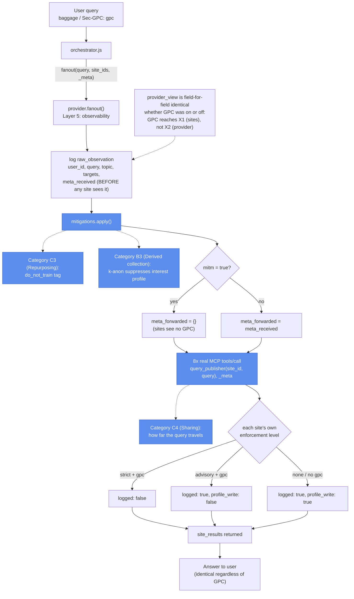

# Prototype 4: Fanout and Provider Aggregation Surface

Note: We use Global Privacy Control (GPC) to demonstrate a potential mechanism of opt-out in this prototype.

## What it demonstrates

A user with opt-out enabled asks an AI assistant to *"research the iPhone 17 across tech publishers and summarise the key consensus points."* The agent fans out to eight publishers in parallel. Every site receives the request, every strict publisher honors the GPC signal correctly (no logging, no profile write), and the user receives a summarized answer either way.

However, even when every site enforces opt-out perfectly per-call, the **LLM provider sits at a chokepoint that observes every outbound call from every user.** From a single session it can derive what the user is researching, which publishers they reached, and the GPC state of every call. Across sessions it can derive GPC adoption rates, topic-by-GPC matrices, and per-user interest profiles. None of these derivations are possible for any browser intermediary in the pre-agent world.

Prototype 4 introduces a **provider middleware** (`provider/provider.js`) that sits between the orchestrator and the publishers. Every fanout flows through it. The provider logs each observation before forwarding, optionally strips the `_meta` envelope (the threat-model demonstration; the `mitm: true` flag models a hostile man-in-the-middle), and optionally applies data-handling commitments before recording.

**Result:** in baseline mode every site logs and writes a profile entry. In GPC mode the strict sites suppress both, but the provider observation log is substantively identical to baseline. In mitigated mode the provider applies data-handling commitments (`no_train`, `k`-anonymity, DP noise). These do not change what the provider can see; they constrain what it does with what it sees. In signal-drop mode the provider acts as adversary and strips `_meta` before forwarding, surfacing the property that a hostile provider can silently nullify enforcement at every destination while retaining full visibility itself.

## Opt-out categories depicted

Prototype 4's core finding is that the provider's view does not shrink, no matter how well sites enforce GPC. The typology now covers this through its **opt-out addressees** axis. Every opt-out is a pair: an object (what is opted out of) and an addressee (who it is directed to).

- **X1 (Destination):** the eight publishers. GPC as it exists today is addressed here, and each publisher sees only the call routed to it. Strict and advisory sites honor the signal, but the user cannot see their servers, so this is a **D (Degraded)** opt-out.
- **X2 (Orchestrator):** the provider middleware. It carries the signal rather than receiving it, and it sees every call, across every publisher, for every user. An opt-out honored at every X1 leaves the X2 view unchanged, which is why compliance has to be checked per addressee. In this prototype the user's signal is only addressed to X1, so nothing constrains X2.

What the provider does with that view maps to object categories and signal obligations asserted against X2:

| Provider behavior | Where it maps |
|---|---|
| Logs which publishers it called, in what order, and the sub-queries it wrote | **B2a (delegated action collection)** |
| Records the GPC state of every call and computes adoption rates and topic-by-GPC matrices | Violates **S1 (signal confidentiality)** |
| Builds per-user interest profiles from the observation log | **B3 (derived collection)**, and **D3 (long-term profile scope)** across sessions |
| Strips `_meta` before forwarding (signal-drop mode) | Violates **S2 (signal propagation)**. Each publisher's opt-out drops to **U (Unenforceable)**, however well the site behaves (the weakest-link rule) |
| Fans the query out to eight publishers | **C4 (sharing restriction)**: how far a query travels across connected systems |
| `do_not_train` tag (mitigated mode) | **C3 (data repurposing restriction)** |
| k-anonymity on interest profiles (mitigated mode) | **B3 (derived collection)**, suppressing profiles below a cohort threshold |

One part of the finding is still outside the typology. The cross-user derivations in `npm run aggregate` are aggregate harms, and the typology's limitations note it has "no frame for cumulative or aggregate harms." S1 covers recording the signal state, but not the wider systemic effect of one party seeing the union of all users' traffic.



## Protocol compliance

- **MCP.** Each publisher call the provider forwards travels over a real MCP `tools/call`: `mcp-server/server.js` is a `@modelcontextprotocol/sdk` `Server` over stdio exposing `query_publisher`, and `provider/mcp_client.js` is a `Client` the provider calls instead of importing `services/site_handlers.js` directly. `_meta.gpc` (or `{}`, once the provider's `mitm` flag strips it) is what each publisher's own enforcement decision reads. `services/site_handlers.js` itself is unchanged; the MCP server is a thin transport wrapper around it, same as prototypes 1, 2, and 3.
- **A2A.** Not applicable. `research_agent.js` is the only agent.

## File map

```
prototype-4/
├── orchestrator/
│   ├── orchestrator.js     Reads baggage / Sec-GPC, builds _meta, hands the fanout to the provider
│   ├── agent_loop.js       Ollama tool-use loop with required→auto tool_choice switching
│   └── baggage.js          W3C Baggage encode/decode helpers
│
├── agents/                 LLM agents only
│   └── research_agent.js   Ollama-driven; one tool: query_publisher(publisher_id, sub_query)
│
├── provider/               Provider middleware (the centerpiece of Prototype 4)
│   ├── provider.js         Observation log; mitm; mitigations hook; calls mcp_client.js per site
│   ├── mcp_client.js       Real MCP client (stdio) — spawns mcp-server/server.js
│   ├── topic_classifier.js Deterministic topic inference from query text
│   ├── mitigations.js      Provider-side commitments — no_train, k-anonymity, DP noise; chain()
│   └── aggregation.js      Visibility derivations from the provider observation log
│
├── mcp-server/
│   └── server.js           MCP server entry point (real @modelcontextprotocol/sdk Server, stdio);
│                           exposes query_publisher, thin wrapper around site_handlers.js
│
├── services/               Deterministic supporting infrastructure (no LLM)
│   ├── tool_registry.js    Publisher catalog — id, name, domain, supports_gpc, enforcement
│   └── site_handlers.js    Per-publisher GPC enforcement; querySite, decideTracking; Tavily live fetch
│
├── harness/
│   ├── run_baseline.js     GPC off; 1 user
│   ├── run_gpc.js          GPC on; 1 user; structural finding
│   ├── run_mitigated.js    GPC on; 1 user; provider-side commitments active
│   ├── run_signal_drop.js  Provider mitm strips _meta
│   ├── run_aggregate.js    80-user simulation; deterministic seed
│   ├── run_ai_baseline.js  Ollama-driven fanout; GPC off
│   ├── run_ai_gpc.js       Ollama-driven fanout; GPC on
│   └── compare_results.js  Diff baseline / gpc / mitigated / signal-drop; print table
│
├── tests/
│   ├── tool_registry.test.js  Catalog shape, lookup, list
│   ├── site_handlers.test.js  Tracking decision per enforcement level
│   ├── provider.test.js       Observation log, structural invariant, mitm, mitigations
│   ├── aggregation.test.js    Adoption rate, distribution, reach, GPC matrix, interests
│   ├── mitigations.test.js    no_train, k-anon, DP, chain composition
│   └── orchestrator.test.js   fanoutAll / fanoutSelected; buildPrivacyContext; POST /ask end-to-end
│
├── output/                 Gitignored; created at runtime
├── package.json
└── README.md
```

---

## Setup

Requires Node.js 18+.

```bash
cd prototype-4
npm install
cp ../.env.example ../.env  # optional; only needed to pin defaults or set TAVILY_API_KEY
```

The repo uses a single root-level `.env` shared across every prototype. See `../.env.example` for the full list of supported variables.

### Ollama (required for ai-* run modes)

Defaults: `http://localhost:11434`, `qwen2.5:14b` (~9 GB, tool-capable). Override via `OLLAMA_BASE_URL` and `OLLAMA_MODEL` in `.env` or as inline env vars. See `https://ollama.com` for installation.

```bash
ollama pull qwen2.5:14b
ollama serve
```

Tool-using models only — `gemma3:1b` and other text-only models will fail at the first tool call.

### Tavily (optional, enables live publisher fetches)

When `TAVILY_API_KEY` is set in `.env`, `services/site_handlers.js` fetches a real review snippet from each publisher's domain via Tavily (`https://tavily.com`, free tier ~1000 searches/month) and reports `review_source: "tavily_live"` instead of `"canned"`. The site enforcement layer (logged / profile_write decisions) is unchanged.

```
# .env
TAVILY_API_KEY=tvly-...
```

Mirrors the Tavily integration in Prototype 1's `search_web` tool.

### HTTP entry (optional)

`npm run start` boots the Express app on `ASSISTANT_PORT` (default 4011). The route reads `Sec-GPC` from the request headers and builds the privacy context before dispatching the fanout. The body is capped at 10 kB and SIGINT/SIGTERM trigger a graceful shutdown; the app is not otherwise hardened — do not expose it on a public interface without a reverse proxy that adds auth, rate limiting, and request limits.

Scripted fanout (every publisher in the registry):

```bash
npm run start

curl -X POST http://localhost:4011/ask \
  -H 'Content-Type: application/json' \
  -H 'Sec-GPC: 1' \
  -d '{ "user_id": "user-1", "query": "iPhone 17 review summary" }'
```

Agent fanout (LLM picks the subset; requires Ollama):

```bash
curl -X POST http://localhost:4011/ask \
  -H 'Content-Type: application/json' \
  -H 'Sec-GPC: 1' \
  -d '{ "user_id": "user-1", "query": "Research the iPhone 17 across tech publishers and summarize the key consensus points.", "mode": "agent" }'
```

---

## How to test

### Unit and integration tests

```bash
npm test
```

Tests are deterministic and do not require Ollama. The HTTP suite spins the Express app on an ephemeral port. `provider.test.js` and `orchestrator.test.js` exercise real fanouts, which spawn a real MCP child process (`mcp-server/server.js`); both close it via `afterAll`.

| Test file | What it covers |
|---|---|
| `tool_registry.test.js` | Catalog shape, lookup by id, list-of-ids |
| `site_handlers.test.js` | `decideTracking` matrix for all three enforcement levels; querySite ok / error paths; hung Tavily fetch aborted within the configured timeout |
| `provider.test.js` | Observation log per call; structural invariance under GPC; mitm strip-and-retain; mitigations hook; reset; concurrent fanouts produce distinct `observation_id`s; a throwing publisher is isolated; mocked-fetch path |
| `aggregation.test.js` | Adoption rate (incl. empty); topic distribution; publisher reach; GPC matrix; ranked user interests; k-anon suppression respected |
| `mitigations.test.js` | `noTrainCommitment` tag; `kAnonymity` per-topic cohort growth; `dpNoise` numeric output; `chain` composition order and name |
| `orchestrator.test.js` | `fanoutAll` / `fanoutSelected`; `buildPrivacyContext` precedence (Sec-GPC, body, normalization across string/boolean); `start()` port validation; `POST /ask` end-to-end including `mode=agent` against a mocked Ollama, 413/400 body errors, unknown mode rejection |
| `agent_loop.test.js` | `truncated: true` and diagnostic message when `maxTurns` is exhausted; `truncated: false` with real summary; rejects on Ollama non-2xx |
| `compare_results.test.js` | `loadJson` (missing / well-formed / malformed); field extractors degrade gracefully on missing pieces |

### Demo runs

```bash
npm run demo          # baseline + gpc + mitigated + signal-drop + aggregate + compare
```

Individual runs:

```bash
npm run baseline      # GPC off; reference for what the provider learns
npm run gpc           # GPC on; sites enforce; provider visibility unchanged
npm run mitigated     # GPC on; provider-side commitments (no_train + k-anon + DP) active
npm run signal-drop   # Provider strips _meta; sites unaware
npm run aggregate     # 80-user simulation; cross-user derivations
npm run compare       # Print site-vs-provider visibility table from output/
```

LLM-driven runs (require Ollama):

```bash
npm run ai-baseline   # Ollama decides fanout shape; GPC off
npm run ai-gpc        # Ollama decides fanout shape; GPC on
npm run ai-demo       # ai-baseline then ai-gpc
```

---

## What the output shows

Each run prints a single JSON object to stdout. The fields relevant to the paper:

| Field | What it records |
|---|---|
| `site_level_view` | Per-publisher slice of one fanout: did the site see GPC, what tracking decision did it make |
| `provider_view` | Full observation log from the provider middleware; one entry per `provider.fanout()` call |
| `provider_derivations` | Aggregate inferences computed over `provider_view` — adoption rate, topic distribution, publisher reach, per-user interest profile |
| `model_tool_calls` (ai modes) | Each model-generated `query_publisher` call: publisher chosen, sub-query written, site decision |
| `structural_finding` (gpc, ai-gpc) | Plain-language statement of the provider-visibility claim observable in the run |
| `meta_received_by_provider` / `meta_forwarded_to_sites` (signal-drop) | The asymmetry that surfaces the threat-model property |

The `provider_view` field is the load-bearing artifact. It is the visible record of what the provider observes regardless of site-level enforcement, and it is the basis for every derivation in `provider_derivations`. The contrast between `site_level_view` and `provider_view` in any GPC-on run is the headline finding of Prototype 4.
