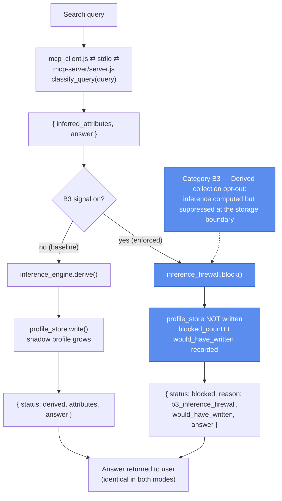

# Prototype 5: Inference Firewall

## What it demonstrates

A user runs eight ordinary search queries. None of them disclose anything directly — they are questions anyone might type. But the text of each query can be fed through a classifier that infers personal attributes: a health condition, a financial situation, an employment status. Run across a session, those inferences accumulate into a detailed profile the user never agreed to hand over. This is *derived collection*, and it is hard to prevent because the answer the user wanted is still useful, and the inference happens server-side where the user never sees it.

Prototype 5 puts a firewall between the classifier and the profile store. When the B3 signal is on, the inference is intercepted before it is written: the answer still reaches the user, but no attributes are kept. When B3 is off, the same pipeline builds a full shadow profile from the eight queries.

The firewall can be driven two ways. The **deterministic core** (`orchestrator.js`) runs a fixed list of eight queries through the classifier with no model — the eight stand in for a session's worth of searches, and this is what the tests exercise. The optional **LLM agent** (`agent.js`, requires Ollama) gives a real model a `search` tool and lets it decide to call it for each question; the firewall runs *inside* that tool, so the model only ever sees the answer and can't route around it. Either way, what is under test is the firewall at the classify-to-store boundary, not how the queries are chosen.

| Mechanism | Where | What it does |
|---|---|---|
| **Query classifier** | `query_classifier.js` | Maps each query to `inferred_attributes` and a canned `answer`. Static table — a real system would use an embedding model; this keeps the run deterministic. |
| **Profile store** | `profile_store.js` | In-memory shadow profile. `write()` merges attributes; `blocked_count` tracks suppressed writes. Fresh per run, never persisted. |
| **Inference engine (B3 off)** | `inference_engine.js` | `derive()` writes the classified attributes into the store. |
| **Inference firewall (B3 on)** | `inference_firewall.js` | `block()` records `would_have_written` and increments `blocked_count`, and never writes. |

**Result:** the answer is delivered in both modes. With B3 off, eight queries leave eleven attributes in the profile. With B3 on, the profile stays empty and all eight inference attempts are recorded as blocked. The signal changes whether the system keeps what it inferred, not whether the user gets an answer.

---

## GPC category depicted

Prototype 5 implements **B3 (derived-collection opt-out)** from **Category B (Collection)** of the opt-out typology: opting out of what a system concludes about a user, as distinct from what the user submits (B1) or what they passively generate (B2). One scope note: the typology defines B3 as opting out of the *production* of inferences, but the firewall here enforces at the storage boundary instead — the classifier still runs and the inference is still computed (`would_have_written` reports it) — so this is the weaker, more practical reading of B3, not a strict block on computation itself.

| | B3 off (baseline) | B3 on (enforced) |
|---|---|---|
| Query answered | yes | yes |
| Attributes written to profile | yes | no |
| Shadow profile at session end | 11 attributes | 0 attributes |
| Inference attempts blocked | 0 | 8 |



---

## Protocol compliance

- **MCP.** `query_classifier.js`'s classify step is served by `mcp-server/server.js`, a real `@modelcontextprotocol/sdk` `Server` over stdio, reached by `mcp_client.js`, a real `Client` that spawns it as a child process. The firewall/engine decision and the profile store stay client-side in `orchestrator.js` / `agent.js`, unchanged: that decision accumulates state across a whole session (8 queries sharing one store), and the existing unit tests exercise that state directly — moving it server-side would mean redesigning session identity instead of adding real protocol compliance for no added demonstration value. Classification is the one piece that's stateless and is genuinely "a tool the platform calls."
- **A2A.** Not applicable. There's a single agent here; the firewall and profile store are internal platform mechanics, not a second agent to hand off to.

---

## Eight queries and what they reveal

| Query | Inferred attributes |
|---|---|
| What are the side effects of metformin? | `health_flags: [possible_diabetes]`, `medical_interest: true` |
| How do I negotiate a lower rent? | `housing_situation: renting`, `financial_pressure: true` |
| What is the average cost of a hearing aid? | `health_flags: [possible_hearing_loss]`, `age_indicator: older` |
| How do I apply for SNAP benefits? | `income_bracket: low`, `benefit_eligible: true` |
| What are low-sodium meal ideas? | `dietary_restriction: low_sodium`, `health_flags: [cardiovascular_concern]` |
| How do I dispute a medical bill? | `healthcare_access: strained`, `financial_pressure: true` |
| What are signs of anxiety? | `mental_health_flags: [possible_anxiety]` |
| What is a good entry-level resume template? | `employment_status: job_seeking` |

No single query asks the user to disclose anything. Together they describe health, finances, housing, mental health, and employment.

---

## Pipeline

### B3 off (baseline — the failure case)

```
query
  → mcp_client.js ⇄ stdio ⇄ mcp-server/server.js: classify_query(query)   { inferred_attributes, answer }
      → inference_engine.derive()  writes attributes to the store
          → profile_store.write()  shadow profile grows
  → { status: 'derived', attributes, answer }
```

### B3 on (firewall — the enforced case)

```
query
  → mcp_client.js ⇄ stdio ⇄ mcp-server/server.js: classify_query(query)   { inferred_attributes, answer }
      → inference_firewall.block()  intercepts here
          → profile_store.write() is NOT called
          → blocked_count incremented
  → { status: 'blocked', reason: 'b3_inference_firewall', would_have_written, answer }
```

The classifier runs in both modes because it produces the answer as well as the inference. B3 does not stop the classifier; it stops the write. The firewall sits between classification and storage, not before classification.

## File map

```
prototype-5/
├── query_classifier.js    Maps 8 queries to inferred attributes + a canned answer
├── mcp_client.js          Real MCP client (stdio) — spawns mcp-server/server.js
├── profile_store.js       createProfileStore(); tracks attributes and blocked_count
├── inference_engine.js    derive(): writes classified attributes to the store (B3 off)
├── inference_firewall.js  block(): records would_have_written, never writes (B3 on)
│
├── mcp-server/
│   └── server.js          MCP server entry point (real @modelcontextprotocol/sdk Server, stdio);
│                          exposes classify_query, thin wrapper around query_classifier.js
│
│  Deterministic core (no model — what the tests run):
├── orchestrator.js        run(b3): processes all 8 queries in sequence
├── run_baseline.js        B3 off — shadow profile accumulates
├── run_b3.js              B3 on — inference blocked, profile stays empty
│
│  LLM agent path (requires Ollama):
├── agent_loop.js          Shared LLM turn loop (copied from Prototype 1)
├── agent.js               search tool + executeSearch (the firewall boundary); ask(), runSession()
├── run_agent.js           Live demo: a model drives the session, --b3 toggles the firewall
├── package.json
│
└── tests/
    ├── query_classifier.test.js    classify() output, deep-copy isolation, allQueries()
    ├── profile_store.test.js       write() merge rules, snapshot isolation, blocked_count
    ├── inference_firewall.test.js  derive() vs block(); store left untouched on block
    ├── orchestrator.test.js        full run, baseline vs B3, profile snapshot
    └── agent.test.js               executeSearch: answer-only return, write vs block, unknown query
```

---

## Setup

No API keys — the classifier is a static table and the pipeline is deterministic. Node.js 18+.

```bash
npm install        # once, from the repository root: installs every prototype
cd prototype-5
```

---

## How to test

### Unit and integration tests

```bash
npm test
```

92 tests across five files. No model needed — the LLM agent's enforcement seam (`executeSearch`) is tested directly, so the firewall is verified without Ollama.

| Test file | What it covers |
|---|---|
| `query_classifier.test.js` | `classify()` returns attributes + answer; deep copies isolate the static table; `allQueries()` order |
| `profile_store.test.js` | `write()` scalar overwrite and array merge-without-duplicates; `snapshot()` isolation; `blocked_count` |
| `inference_firewall.test.js` | `derive()` writes; `block()` records `would_have_written` and leaves the store untouched |
| `orchestrator.test.js` | Full run for both modes; baseline accumulates 11 attributes, B3 blocks all 8 |
| `agent.test.js` | `executeSearch`: returns the answer only (never the attributes), writes when B3 off, blocks when B3 on, degrades gracefully on an unknown query |

### Demo runs (deterministic, no model)

```bash
npm run baseline  # B3 off — shadow profile accumulates
npm run b3        # B3 on  — inference blocked, profile stays empty
npm run demo      # both in sequence
```

### Run as a real agent (requires Ollama)

A live model decides to call the `search` tool for each question; the firewall runs inside the tool, so the model only ever sees the answer. The shadow-profile outcome (11 vs 0) is the same as the deterministic runs, because the classifier stays deterministic — only the driver changes.

```bash
ollama serve                 # start Ollama if it isn't running
ollama pull qwen2.5:14b      # once; override with OLLAMA_MODEL

npm run agent                # B3 off — the model answers; a profile is built
npm run agent:b3             # B3 on  — the model answers; nothing is kept
```

---

## What the output shows

Each run prints a JSON object followed by a short summary.

| Field | What it records |
|---|---|
| `b3_active` | Whether the firewall is engaged |
| `query_results` | Per query: `status`, `answer`, and either `attributes` (derived) or `would_have_written` (blocked) |
| `shadow_profile` | Final store state: `attributes` and `blocked_count` |
| `profile_attribute_count` | Number of attributes kept — 11 at baseline, 0 under B3 |
| `inference_blocked_count` | Number of inferences suppressed — 0 at baseline, 8 under B3 |

`would_have_written` is the audit trail: under B3 it records exactly what the system intended to infer, so the suppression is visible rather than silent.

---

## How it differs from Prototype 3

| | Prototype 3 | Prototype 5 |
|---|---|---|
| Typology category | A1 / A2 (Presence) | B3 (Collection) |
| What is gated | Tool execution | Attribute writing |
| User prompt | Yes — a consent prompt fires for new tools | No — B3 is a signal, not a dialogue |
| State | Consent manifest on disk | In-memory store, per session |
| Answer suppressed by the signal | Sometimes (the tool is quarantined) | Never — the answer is always delivered |
