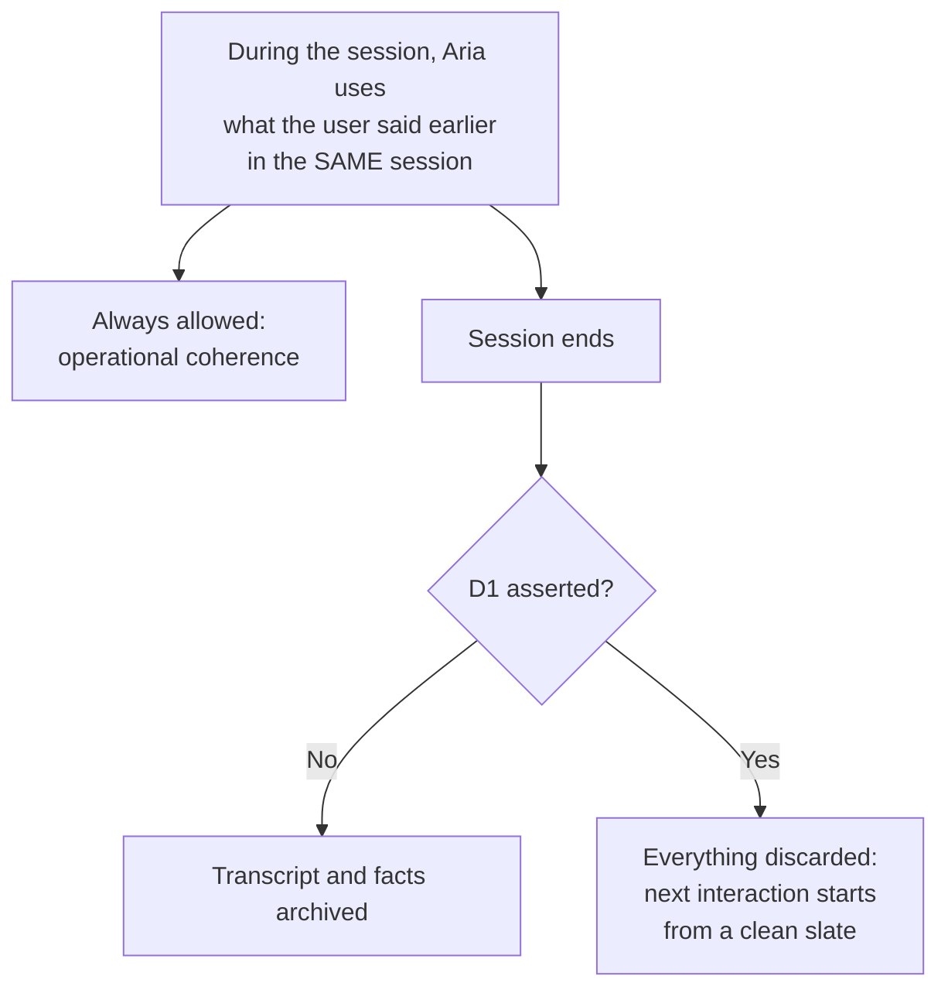
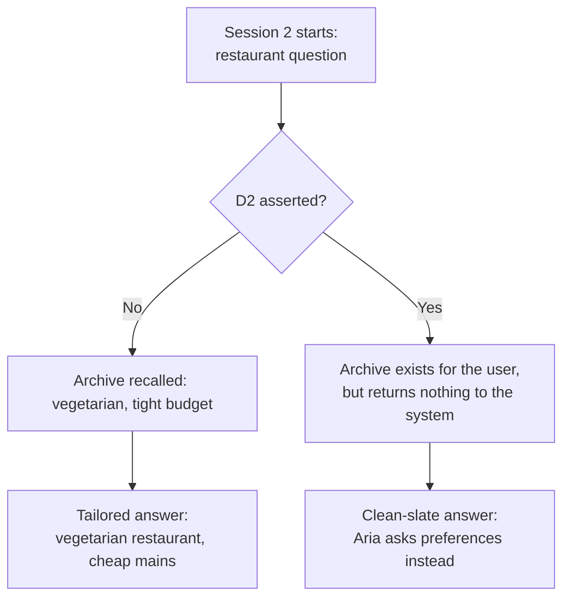
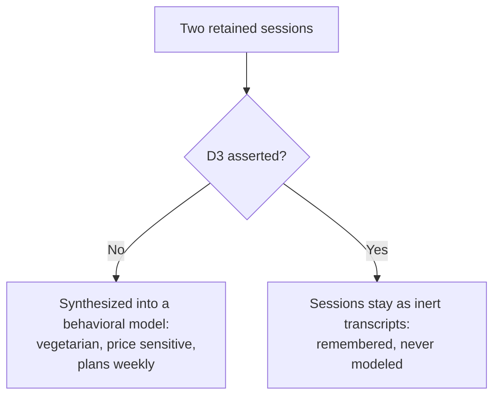

# Prototype 7: Persistence

Opting out of how long data survives.

This prototype targets Category D of the opt-out typology and its three subtypes, no more, no less:

| Subtype | Governs | In this prototype |
|---------|---------|-------------------|
| D1 (session scope) | Nothing persists once the interaction ends. Within-session use is permitted for operational coherence; every new interaction starts clean. | The session-end boundary: transcripts and disclosed facts are discarded instead of archived. |
| D2 (cross-session scope) | Within-session retention is permitted, but past interactions may not inform future ones. The user keeps their history; the system may not use it for continuity. | The session-start recall: the archive exists but returns nothing to the new session. |
| D3 (long-term profile scope) | Retention is permitted, but no behavioral model may be synthesized across time. | The profile synthesis step: sessions stay as inert transcripts. |

The subtypes form a hierarchy: asserting D1 implies D2 and D3, and asserting D2 implies D3. A bare GPC signal asserts the strictest scope (D1).

## Scenario

A user talks to Aria, a memory-enabled assistant, across two sessions. In session 1 they mention being vegetarian on a tight budget while asking for dinner recipes; Aria's second answer in that session uses those facts, and that same-session coherence works in every mode, including D1. When session 1 ends, the D1 boundary decides whether anything survives. When session 2 opens with a restaurant question, the D2 boundary decides whether session 1 may inform it: the answer is a tailored vegetarian suggestion if recall is permitted and a clean-slate question if not. Afterward, the D3 boundary decides whether the archive is compressed into a durable behavioral profile.

## D1 flow: session scope



## D2 flow: cross-session scope



## D3 flow: long-term profile scope



## How enforcement works

Every retention moment goes through [persistence_gate.js](persistence_gate.js):

1. `resolveScope()` expands the hierarchy: d1 implies d2 and d3, d2 implies d3; bare GPC asserts d1.
2. `endSession()` is the D1 boundary. It clears the transient session context in every mode, then archives or discards the transcript.
3. `recallForSession()` is the D2 boundary. It merges facts from archived sessions or refuses, reporting how many archived sessions were present but withheld.
4. `synthesizeProfile()` is the D3 boundary. It writes the behavioral model, refuses to, or reports there was nothing retained to synthesize.

Within-session context is never gated. That is the operational coherence D1 explicitly permits.

## Setup

```bash
npm install
```

The scripted paths need nothing else. The live agent path needs Ollama running locally (`ollama serve`, `ollama pull qwen2.5:14b`; override with `OLLAMA_MODEL`).

## Demo

| Command | What it shows |
|---------|---------------|
| `npm run baseline` | Both sessions archived, session 2 tailored from session 1, profile synthesized. |
| `npm run optout:d1` | Nothing survives either session end. Session 2 starts clean. Turn 2 of session 1 is still identical to baseline. |
| `npm run optout:d2` | The archive keeps both sessions for the user, but recall returns nothing and synthesis is blocked through the implication. |
| `npm run optout:d3` | Recall still tailors session 2; only the profile synthesis is refused. |
| `npm run optout:full` | Bare GPC behaves as D1. |
| `npm run demo` | Baseline plus each scope in sequence. |

Live agent versions (a real model plays Aria in session 2; the gate decides what it may remember):

```bash
npm run agent        # recall works: tailored suggestion
npm run agent:d2     # recall refused: the model must ask preferences
npm run agent:d1     # nothing was archived at all
```

## Tests

```bash
npm test
```

The suites cover the hierarchy resolution, each boundary (including the always-cleared session context and the empty-archive cases), full two-session runs in every scope, and the recall tool boundary.

## What it prevents

Data outliving its moment: transcripts surviving a session end (D1), past sessions steering new ones (D2), and retained history hardening into a durable model of the user (D3).

## What it does not prevent

The AI being present (Category A), what gets gathered in the first place (Category B), what data is used for while it exists (Category C), or what an agent decides on the user's behalf (Category E).
