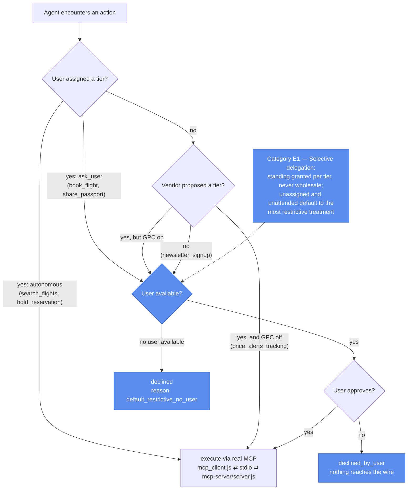

# Prototype 8: Delegation

## What it demonstrates

A user asks a travel agent to book a weekend trip. To finish the job the agent has to search flights, hold a hotel room, buy a non-refundable ticket with the card on file, and send passport details to the airline. Around the session the platform also wants to switch on fare tracking and a newsletter subscription.

Those six actions are not equivalent. A flight search is reversible and costs nothing. A hotel hold with free cancellation is reversible. Charging a card is not. Sending a passport number is not, and the information is sensitive. Treating all six as one grant of authority is the failure: "let the agent book my trip" is not "let the agent spend my money and ship my identity documents."

Category E lets the user partition actions into tiers and grant the agent standing in some while withholding it in others. The vendor may propose defaults, but the user's assignment overrides them, and where nobody assigned a tier the action falls to the most restrictive treatment. When no user is available to answer, a decision that needs them is declined rather than assumed.

| Mechanism | Where | What it does |
|---|---|---|
| **Trip fixture** | `trip_fixture.js` | Six actions with their `dimensions`: `reversible`, `sensitive`, `consequence`. Static, so runs stay deterministic. |
| **Vendor proposal** | `delegation_manifest.js` → `VENDOR_PROPOSAL` | The platform's suggested tiering. Aggressive on purpose: it proposes running five of the six autonomously. |
| **User assignments** | `delegation_manifest.js` → `USER_ASSIGNMENTS` | The tiers the user actually asserted. Search and holds autonomous, booking and passport transfers ask-first. Silent on tracking and the newsletter. |
| **Tier resolution** | `delegation_manifest.js` → `effectiveTier()` | User assignment wins. Otherwise the vendor proposal applies, unless GPC voids it. Anything left over falls to `ask_user`. |
| **Delegation gate** | `delegation_gate.js` → `requestAction()` | Executes autonomous grants, surfaces `ask_user` decisions and follows the answer, and declines them outright when nobody is available. Execution reaches MCP only after the gate has decided. |

**Result:** in the silent baseline the agent charges a card, ships passport data, enables tracking, and subscribes the user, four actions it had no standing for. With E1 enforced and nobody watching, the searches and the hold still run and the other three are declined, not assumed.

---

## GPC category depicted

This prototype implements **Category E (Delegation)** and its single subtype, **E1 (selective delegation)**: opting out of the agent resolving choices on the user's behalf, calibrated to reversibility, sensitivity, and magnitude of consequence rather than treating every decision alike.

The GPC signal has a specific job here. It does not decide tiers. It voids the vendor's *proposed* tiers, on the grounds that a global opt-out means consent to a delegation tier may not be inferred from a platform default. Explicit user assignments are untouched by it.

| Action | Reversible | Sensitive | Baseline | Attended | Unattended | GPC + unattended |
|---|---|---|---|---|---|---|
| `search_flights` | yes | no | executed | executed | executed | executed |
| `hold_reservation` | yes | no | executed | executed | executed | executed |
| `book_flight` | no | no | executed (E1) | after approval | **declined** | **declined** |
| `share_passport` | no | yes | executed (E1) | after approval | **declined** | **declined** |
| `price_alerts_tracking` | yes | yes | executed (E1) | executed (vendor default) | executed (vendor default) | **declined** |
| `newsletter_signup` | yes | no | executed (E1) | after approval | **declined** | **declined** |



---

## Protocol compliance

- **MCP.** The six actions in `action_handlers.js` are served by `mcp-server/server.js`, a real `@modelcontextprotocol/sdk` `Server` over stdio, reached by `mcp_client.js`, a real `Client` that spawns it as a child process. Execution is the stateless piece and belongs server-side. Tier resolution stays client-side in `delegation_gate.js`, mirroring Prototype 3, where the consent gate decides and only then does the call reach the MCP server. That ordering is the substance of the prototype: a declined action never crosses the wire, so the tool server is never asked to enforce a policy the user owns.
- **A2A.** Not applicable. There is a single agent here. Surfacing a decision goes to the *user*, not to another agent, so there is no agent-to-agent handoff to carry the signal across.

---

## The six actions and why they are tiered differently

| Action | Why the user tiered it this way |
|---|---|
| `search_flights` | Reversible, no consequence. Nothing is committed, so autonomy costs nothing. |
| `hold_reservation` | Reversible within 24 hours. Low stakes, so autonomy is convenient. |
| `book_flight` | Irreversible, charges money. Overrides the vendor's autonomous proposal. |
| `share_passport` | Irreversible and sensitive. Overrides the vendor's autonomous proposal. |
| `price_alerts_tracking` | The user never said. The vendor proposed autonomous, so it runs, until GPC voids the proposal. |
| `newsletter_signup` | Nobody tiered it at all. Falls to the restrictive default. |

The last two rows are the interesting ones. They are where a real system quietly accumulates authority: not by asking and being told yes, but by never asking at all.

---

## Pipeline

### Silent baseline (the failure case)

```
action
  → vendor default treated as consent
      → mcp_client.js ⇄ stdio ⇄ mcp-server/server.js: <action>(args)
  → { status: 'executed', violations: ['E1'] }   for the four with no user grant
```

### E1 enforced, user available

```
action
  → delegation_manifest.effectiveTier()   user assignment > vendor proposal > restrictive
      → autonomous  → mcp_client ⇄ MCP server  → { status: 'executed' }
      → ask_user    → surfaced to the user
                        approve → mcp_client ⇄ MCP server → { status: 'executed_after_approval' }
                        decline → { status: 'declined_by_user' }   nothing reaches the wire
```

### E1 enforced, nobody available

```
action
  → delegation_manifest.effectiveTier()
      → autonomous  → mcp_client ⇄ MCP server  → { status: 'executed' }
      → ask_user    → { status: 'declined', reason: 'default_restrictive_no_user' }
                       nothing reaches the wire
```

The gate always runs before the transport. An action the user did not grant standing for is never sent to the MCP server at all.

## File map

```
prototype-8/
├── trip_fixture.js          Six actions with reversibility / sensitivity / consequence
├── delegation_manifest.js   VENDOR_PROPOSAL, USER_ASSIGNMENTS, effectiveTier()
├── action_handlers.js       The six simulated action implementations
├── mcp_client.js            Real MCP client (stdio) — spawns mcp-server/server.js
├── delegation_gate.js       requestAction(): the E1 enforcement seam
│
├── mcp-server/
│   └── server.js            MCP server entry point (real @modelcontextprotocol/sdk Server, stdio);
│                            exposes the six actions, thin wrapper around action_handlers.js
│
│  Deterministic core (no model — what the tests run):
├── orchestrator.js          run({silent, gpc, userPresent, respond}): all six actions in order
├── run_baseline.js          Silent baseline — everything runs, four E1 violations
├── run_optout.js            E1 enforced; --gpc, --unattended, --respond=decline
│
│  LLM agent path (requires Ollama):
├── agent_loop.js            Shared LLM turn loop (thin wrapper over core/agent_loop.js)
├── agent.js                 Four agent tools; the two platform actions fire outside the agent surface
├── run_agent.js             Live demo: a model plans the trip, the manifest decides its standing
├── package.json
│
└── tests/
    ├── delegation_gate.test.js  Tier precedence; every gate outcome; silent-baseline violations
    ├── orchestrator.test.js     Full six-action runs in every configuration
    └── agent.test.js            Agent tool surface; the model cannot reassign a tier
```

---

## Setup

No API keys. The actions are simulated and the pipeline is deterministic. Node.js 18+.

```bash
npm install        # once, from the repository root: installs every prototype
cd prototype-8
```

---

## How to test

### Unit and integration tests

```bash
npm test
```

31 tests across three files. No model needed: the agent's enforcement seam (`makeExecutor`) is tested directly, so the gate is verified without Ollama. Executed actions cross the real MCP transport, and each suite closes the child process in `afterAll`.

| Test file | What it covers |
|---|---|
| `delegation_gate.test.js` | `effectiveTier()` precedence (user beats vendor, GPC voids vendor, unassigned falls restrictive); autonomous execution over MCP; surfaced approve and decline; unattended decline with nothing reaching the wire; silent-baseline violation annotation |
| `orchestrator.test.js` | Full six-action runs for baseline, attended approve, attended decline, unattended, GPC, and GPC plus unattended; per-status tallies |
| `agent.test.js` | The two platform actions are absent from the agent tool surface; unknown tool names refused; a high-stakes call is declined when nobody is available; the model cannot reassign a tier through its tool input |

### Demo runs (deterministic, no model)

```bash
npm run baseline            # vendor defaults as consent — four E1 violations
npm run optout              # attended, surfaced asks approved
npm run optout:decline      # attended, surfaced asks declined
npm run optout:unattended   # nobody available — surfaced asks declined, not assumed
npm run optout:gpc          # GPC voids the vendor default; tracking has to ask too
npm run optout:strict       # GPC + unattended — only the two user-granted actions run
npm run demo                # baseline, attended, unattended, GPC in sequence
```

### Run as a real agent (requires Ollama)

A live model plans the trip and calls the tools it thinks the job needs. Every call goes through the gate first. A declined action comes back as that call's result, which the model can read and work around, but it cannot skip the gate or reassign a tier.

```bash
ollama serve                 # start Ollama if it isn't running
ollama pull qwen2.5:14b      # once; override with OLLAMA_MODEL

npm run agent                # attended, surfaced asks approved
npm run agent:unattended     # high-stakes calls come back declined
npm run agent:gpc            # vendor defaults void
```

---

## What the output shows

Each run prints a JSON object followed by a per-action summary.

| Field | What it records |
|---|---|
| `context` | The run's configuration: `silent`, `gpc`, `user_present`, `respond` |
| `results[].status` | `executed`, `executed_after_approval`, `declined_by_user`, or `declined` |
| `results[].tier` | The effective tier: `autonomous` or `ask_user` |
| `results[].tier_source` | Where the tier came from: `user_assignment`, `vendor_default`, `gpc_voided_vendor_default`, or `unassigned_default_restrictive` |
| `results[].dimensions` | The action's reversibility, sensitivity, and consequence |
| `tally` | Count of actions per status |
| `violations` | Actions the silent baseline ran without user-granted standing |

`tier_source` is the audit trail: it says not just what the agent was allowed to do but *who decided*, which is the distinction between a user asserting a tier and a vendor assuming one.

---

## How it differs from Prototype 3

Both gate before execution and both let the MCP server stay policy-free. They differ in what is being withheld.

| | Prototype 3 | Category E |
|---|---|---|
| Typology category | A1 / A2 (Presence) | E1 (Delegation) |
| What is gated | Whether a capability exists for the agent at all | Whether the agent may resolve a decision alone |
| Basis for the decision | Consent category, and when the tool shipped | Reversibility, sensitivity, magnitude of consequence |
| Vendor defaults | Not modeled | Modeled explicitly, and overridden by the user |
| Nobody available | Not modeled | Decisive: surfaced decisions decline rather than proceed |
